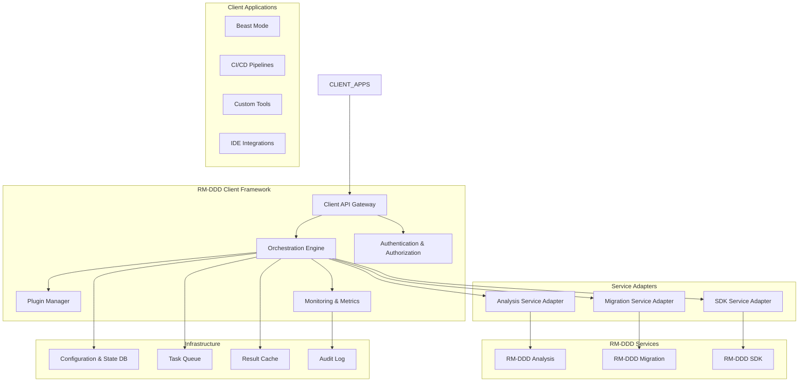

# Design Document

## Overview

The RM-DDD Client is designed as a generalized orchestration framework that provides standardized APIs and integration patterns for consuming RM-DDD services. The architecture follows a plugin-based approach where different orchestration systems (Beast Mode, CI/CD pipelines, custom tools) can implement the client interface to leverage RM-DDD analysis, migration, and SDK capabilities. The design emphasizes extensibility, security, and multi-tenant support while maintaining simplicity for basic use cases.

## Architecture

### High-Level Architecture



### Component Architecture

The client framework is built around a core orchestration engine with pluggable adapters for different RM-DDD services and extensible plugins for custom functionality.

## Components and Interfaces

### 1. Client API Gateway

**Primary Responsibility:** Provide unified API interface for all client applications.

```python
from abc import ABC, abstractmethod
from typing import Dict, Any, List, Optional
from dataclasses import dataclass
from enum import Enum

class RMDDDClientAPI(ABC):
    """Main client API interface"""
    
    @abstractmethod
    async def initiate_analysis(self, request: AnalysisRequest) -> AnalysisSession:
        """Start codebase analysis"""
        pass
    
    @abstractmethod
    async def orchestrate_migration(self, request: MigrationRequest) -> MigrationWorkflow:
        """Coordinate migration workflow"""
        pass
    
    @abstractmethod
    async def generate_implementation(self, request: ImplementationRequest) -> ImplementationResult:
        """Generate domain implementations using SDK"""
        pass
    
    @abstractmethod
    async def get_session_status(self, session_id: str) -> SessionStatus:
        """Get status of any active session"""
        pass

@dataclass
class AnalysisRequest:
    """Request for codebase analysis"""
    codebase_path: str
    analysis_scope: AnalysisScope
    configuration: Dict[str, Any]
    tenant_id: Optional[str] = None
    callback_url: Optional[str] = None

@dataclass
class MigrationRequest:
    """Request for migration workflow"""
    analysis_session_id: str
    migration_strategy: MigrationStrategy
    approval_required: bool = True
    rollback_enabled: bool = True
    tenant_id: Optional[str] = None

@dataclass
class ImplementationRequest:
    """Request for implementation generation"""
    domain_specification: DomainSpec
    target_languages: List[str]
    deployment_target: DeploymentTarget
    tenant_id: Optional[str] = None
```

### 2. Orchestration Engine

**Primary Responsibility:** Coordinate workflows across RM-DDD services and manage execution state.

```python
class OrchestrationEngine:
    """Core orchestration engine for RM-DDD workflows"""
    
    def __init__(self, 
                 service_registry: ServiceRegistry,
                 plugin_manager: PluginManager,
                 state_manager: StateManager):
        self.service_registry = service_registry
        self.plugin_manager = plugin_manager
        self.state_manager = state_manager
        self.workflow_executor = WorkflowExecutor()
    
    async def execute_analysis_workflow(self, request: AnalysisRequest) -> AnalysisSession:
        """Execute analysis workflow with plugin extensions"""
        workflow = await self._build_analysis_workflow(request)
        session = await self.workflow_executor.execute(workflow)
        return session
    
    async def execute_migration_workflow(self, request: MigrationRequest) -> MigrationWorkflow:
        """Execute migration workflow with dependency management"""
        analysis_results = await self.state_manager.get_analysis_results(request.analysis_session_id)
        workflow = await self._build_migration_workflow(request, analysis_results)
        return await self.workflow_executor.execute(workflow)
    
    async def _build_analysis_workflow(self, request: AnalysisRequest) -> Workflow:
        """Build analysis workflow with plugin contributions"""
        workflow = Workflow(f"analysis_{request.codebase_path}")
        
        # Add core analysis tasks
        workflow.add_task(CodebaseDiscoveryTask(request.codebase_path))
        workflow.add_task(BoundedContextAnalysisTask(request.analysis_scope))
        workflow.add_task(TacticalPatternAnalysisTask())
        
        # Add plugin-contributed tasks
        plugin_tasks = await self.plugin_manager.get_analysis_tasks(request)
        for task in plugin_tasks:
            workflow.add_task(task)
        
        return workflow

class WorkflowExecutor:
    """Executes workflows with proper dependency management"""
    
    async def execute(self, workflow: Workflow) -> WorkflowResult:
        """Execute workflow tasks in dependency order"""
        execution_graph = self._build_execution_graph(workflow)
        results = {}
        
        for task_batch in execution_graph.get_execution_batches():
            batch_results = await asyncio.gather(*[
                self._execute_task(task, results) for task in task_batch
            ])
            results.update(dict(zip(task_batch, batch_results)))
        
        return WorkflowResult(workflow.id, results)
```

### 3. Service Adapters

**Primary Responsibility:** Abstract and adapt RM-DDD service interfaces for client consumption.

```python
class AnalysisServiceAdapter:
    """Adapter for RM-DDD Analysis service"""
    
    def __init__(self, analysis_service_client: AnalysisServiceClient):
        self.client = analysis_service_client
        self.result_transformer = AnalysisResultTransformer()
    
    async def analyze_codebase(self, request: AnalysisRequest) -> AnalysisResult:
        """Analyze codebase and transform results for client consumption"""
        raw_results = await self.client.analyze(
            codebase_path=request.codebase_path,
            scope=request.analysis_scope,
            config=request.configuration
        )
        
        return self.result_transformer.transform(raw_results)
    
    async def get_bounded_contexts(self, analysis_id: str) -> List[BoundedContextRecommendation]:
        """Get bounded context recommendations"""
        contexts = await self.client.get_bounded_contexts(analysis_id)
        return [self._transform_context(ctx) for ctx in contexts]

class MigrationServiceAdapter:
    """Adapter for RM-DDD Migration service"""
    
    def __init__(self, migration_service_client: MigrationServiceClient):
        self.client = migration_service_client
        self.task_coordinator = MigrationTaskCoordinator()
    
    async def create_migration_plan(self, 
                                  analysis_results: AnalysisResult,
                                  strategy: MigrationStrategy) -> MigrationPlan:
        """Create migration plan from analysis results"""
        raw_plan = await self.client.create_plan(analysis_results, strategy)
        return self.task_coordinator.optimize_plan(raw_plan)
    
    async def execute_migration_task(self, task: MigrationTask) -> MigrationTaskResult:
        """Execute individual migration task"""
        return await self.client.execute_task(task)

class SDKServiceAdapter:
    """Adapter for RM-DDD SDK service"""
    
    def __init__(self, sdk_service_client: SDKServiceClient):
        self.client = sdk_service_client
        self.code_generator = CodeGenerationOrchestrator()
    
    async def generate_domain_code(self, spec: DomainSpec) -> GeneratedCode:
        """Generate domain code using SDK"""
        return await self.code_generator.generate(spec, self.client)
    
    async def validate_implementation(self, code: str, patterns: List[str]) -> ValidationResult:
        """Validate implementation against RM-DDD patterns"""
        return await self.client.validate(code, patterns)
```

### 4. Plugin Manager

**Primary Responsibility:** Manage plugin lifecycle and provide extension points for custom functionality.

```python
class PluginManager:
    """Manages plugin lifecycle and extension points"""
    
    def __init__(self):
        self.plugins: Dict[str, Plugin] = {}
        self.extension_points: Dict[str, List[Plugin]] = {}
    
    async def register_plugin(self, plugin: Plugin):
        """Register plugin and its extension points"""
        await plugin.initialize()
        self.plugins[plugin.id] = plugin
        
        for extension_point in plugin.get_extension_points():
            if extension_point not in self.extension_points:
                self.extension_points[extension_point] = []
            self.extension_points[extension_point].append(plugin)
    
    async def get_analysis_tasks(self, request: AnalysisRequest) -> List[AnalysisTask]:
        """Get plugin-contributed analysis tasks"""
        tasks = []
        for plugin in self.extension_points.get('analysis_tasks', []):
            plugin_tasks = await plugin.contribute_analysis_tasks(request)
            tasks.extend(plugin_tasks)
        return tasks
    
    async def get_migration_strategies(self, analysis_results: AnalysisResult) -> List[MigrationStrategy]:
        """Get plugin-contributed migration strategies"""
        strategies = []
        for plugin in self.extension_points.get('migration_strategies', []):
            plugin_strategies = await plugin.contribute_migration_strategies(analysis_results)
            strategies.extend(plugin_strategies)
        return strategies

class Plugin(ABC):
    """Base class for all plugins"""
    
    @property
    @abstractmethod
    def id(self) -> str:
        """Unique plugin identifier"""
        pass
    
    @abstractmethod
    async def initialize(self):
        """Initialize plugin"""
        pass
    
    @abstractmethod
    def get_extension_points(self) -> List[str]:
        """Get list of extension points this plugin contributes to"""
        pass

class BeastModePlugin(Plugin):
    """Beast Mode specific plugin implementation"""
    
    @property
    def id(self) -> str:
        return "beast_mode_integration"
    
    async def initialize(self):
        """Initialize Beast Mode integration"""
        self.pdca_orchestrator = PDCAOrchestrator()
        self.rm_registry = get_global_registry()
    
    def get_extension_points(self) -> List[str]:
        return ['analysis_tasks', 'migration_strategies', 'health_monitoring']
    
    async def contribute_analysis_tasks(self, request: AnalysisRequest) -> List[AnalysisTask]:
        """Contribute Beast Mode specific analysis tasks"""
        return [
            PDCAComplianceAnalysisTask(),
            SystematicPatternAnalysisTask(),
            RMRegistryIntegrationAnalysisTask()
        ]
    
    async def contribute_migration_strategies(self, analysis_results: AnalysisResult) -> List[MigrationStrategy]:
        """Contribute Beast Mode specific migration strategies"""
        return [
            PDCADrivenMigrationStrategy(analysis_results),
            SystematicRefactoringStrategy(analysis_results)
        ]
```

### 5. Authentication & Authorization

**Primary Responsibility:** Provide secure access control and tenant isolation.

```python
class AuthenticationManager:
    """Manages authentication and authorization"""
    
    def __init__(self, auth_provider: AuthProvider):
        self.auth_provider = auth_provider
        self.rbac_manager = RBACManager()
    
    async def authenticate_request(self, request: ClientRequest) -> AuthContext:
        """Authenticate incoming request"""
        token = self._extract_token(request)
        user_info = await self.auth_provider.validate_token(token)
        return AuthContext(user_info.user_id, user_info.tenant_id, user_info.roles)
    
    async def authorize_operation(self, auth_context: AuthContext, operation: str, resource: str) -> bool:
        """Authorize operation for authenticated user"""
        return await self.rbac_manager.check_permission(
            auth_context.user_id,
            auth_context.roles,
            operation,
            resource,
            auth_context.tenant_id
        )

class TenantIsolationManager:
    """Manages multi-tenant isolation"""
    
    def __init__(self):
        self.tenant_configs: Dict[str, TenantConfig] = {}
        self.resource_quotas: Dict[str, ResourceQuota] = {}
    
    async def get_tenant_config(self, tenant_id: str) -> TenantConfig:
        """Get tenant-specific configuration"""
        return self.tenant_configs.get(tenant_id, self._get_default_config())
    
    async def check_resource_quota(self, tenant_id: str, resource_type: str, requested_amount: int) -> bool:
        """Check if tenant has sufficient resource quota"""
        quota = self.resource_quotas.get(tenant_id)
        if not quota:
            return True  # No quota restrictions
        
        current_usage = await self._get_current_usage(tenant_id, resource_type)
        return current_usage + requested_amount <= quota.get_limit(resource_type)
```

### 6. Monitoring & Metrics

**Primary Responsibility:** Provide comprehensive monitoring, metrics collection, and alerting.

```python
class MonitoringManager:
    """Manages monitoring and metrics collection"""
    
    def __init__(self, metrics_collector: MetricsCollector, alerting_system: AlertingSystem):
        self.metrics_collector = metrics_collector
        self.alerting_system = alerting_system
        self.dashboards: Dict[str, Dashboard] = {}
    
    async def track_operation(self, operation: str, tenant_id: str, metadata: Dict[str, Any]):
        """Track operation metrics"""
        await self.metrics_collector.record_operation(
            operation=operation,
            tenant_id=tenant_id,
            timestamp=datetime.now(),
            metadata=metadata
        )
    
    async def check_health(self) -> HealthStatus:
        """Check overall system health"""
        service_health = await self._check_service_health()
        resource_health = await self._check_resource_health()
        
        overall_status = self._aggregate_health_status([service_health, resource_health])
        
        if overall_status.status == HealthStatusType.DEGRADED:
            await self.alerting_system.send_alert(
                AlertLevel.WARNING,
                f"System health degraded: {overall_status.message}"
            )
        
        return overall_status
    
    async def generate_report(self, tenant_id: str, report_type: str, time_range: TimeRange) -> Report:
        """Generate monitoring report"""
        metrics = await self.metrics_collector.get_metrics(tenant_id, time_range)
        return ReportGenerator.generate(report_type, metrics)

class Dashboard:
    """Real-time monitoring dashboard"""
    
    def __init__(self, dashboard_id: str, tenant_id: Optional[str] = None):
        self.dashboard_id = dashboard_id
        self.tenant_id = tenant_id
        self.widgets: List[DashboardWidget] = []
    
    async def add_widget(self, widget: DashboardWidget):
        """Add widget to dashboard"""
        self.widgets.append(widget)
    
    async def get_real_time_data(self) -> Dict[str, Any]:
        """Get real-time data for all widgets"""
        data = {}
        for widget in self.widgets:
            widget_data = await widget.get_data(self.tenant_id)
            data[widget.id] = widget_data
        return data
```

## Data Models

### Core Models

```python
@dataclass
class AnalysisSession:
    """Analysis session information"""
    session_id: str
    codebase_path: str
    status: SessionStatus
    created_at: datetime
    completed_at: Optional[datetime]
    results: Optional[AnalysisResult]
    tenant_id: Optional[str]

@dataclass
class MigrationWorkflow:
    """Migration workflow information"""
    workflow_id: str
    analysis_session_id: str
    status: WorkflowStatus
    tasks: List[MigrationTask]
    progress: WorkflowProgress
    tenant_id: Optional[str]

@dataclass
class SessionStatus:
    """Generic session status"""
    status: SessionStatusType
    progress_percentage: float
    current_phase: str
    estimated_completion: Optional[datetime]
    error_message: Optional[str]

class SessionStatusType(Enum):
    PENDING = "pending"
    RUNNING = "running"
    COMPLETED = "completed"
    FAILED = "failed"
    CANCELLED = "cancelled"

@dataclass
class TenantConfig:
    """Tenant-specific configuration"""
    tenant_id: str
    analysis_config: Dict[str, Any]
    migration_config: Dict[str, Any]
    sdk_config: Dict[str, Any]
    custom_plugins: List[str]
    resource_limits: Dict[str, int]
```

## Error Handling

### Exception Hierarchy

```python
class RMDDDClientException(Exception):
    """Base exception for RM-DDD Client"""
    def __init__(self, message: str, error_code: str, tenant_id: Optional[str] = None):
        self.message = message
        self.error_code = error_code
        self.tenant_id = tenant_id
        super().__init__(message)

class AuthenticationException(RMDDDClientException):
    """Authentication failure"""
    pass

class AuthorizationException(RMDDDClientException):
    """Authorization failure"""
    pass

class ResourceQuotaExceededException(RMDDDClientException):
    """Resource quota exceeded"""
    def __init__(self, tenant_id: str, resource_type: str, requested: int, available: int):
        self.resource_type = resource_type
        self.requested = requested
        self.available = available
        super().__init__(
            f"Resource quota exceeded for {resource_type}: requested {requested}, available {available}",
            "QUOTA_EXCEEDED",
            tenant_id
        )

class ServiceUnavailableException(RMDDDClientException):
    """RM-DDD service unavailable"""
    def __init__(self, service_name: str, retry_after: Optional[int] = None):
        self.service_name = service_name
        self.retry_after = retry_after
        super().__init__(
            f"Service {service_name} is currently unavailable",
            "SERVICE_UNAVAILABLE"
        )
```

## Security Considerations

### Access Control

```python
class SecurityManager:
    """Manages security policies and enforcement"""
    
    def __init__(self):
        self.encryption_manager = EncryptionManager()
        self.audit_logger = AuditLogger()
    
    async def encrypt_sensitive_data(self, data: Any, tenant_id: str) -> EncryptedData:
        """Encrypt sensitive data using tenant-specific keys"""
        tenant_key = await self._get_tenant_encryption_key(tenant_id)
        return self.encryption_manager.encrypt(data, tenant_key)
    
    async def audit_operation(self, operation: str, user_id: str, tenant_id: str, details: Dict[str, Any]):
        """Audit operation for compliance"""
        await self.audit_logger.log_operation(
            operation=operation,
            user_id=user_id,
            tenant_id=tenant_id,
            timestamp=datetime.now(),
            details=details
        )
```

## Performance Optimization

### Caching Strategy

```python
class CacheManager:
    """Manages caching for performance optimization"""
    
    def __init__(self, cache_backend: CacheBackend):
        self.cache = cache_backend
        self.cache_policies: Dict[str, CachePolicy] = {}
    
    async def get_cached_analysis(self, codebase_hash: str, tenant_id: str) -> Optional[AnalysisResult]:
        """Get cached analysis results"""
        cache_key = f"analysis:{tenant_id}:{codebase_hash}"
        return await self.cache.get(cache_key)
    
    async def cache_analysis_result(self, codebase_hash: str, tenant_id: str, result: AnalysisResult):
        """Cache analysis results"""
        cache_key = f"analysis:{tenant_id}:{codebase_hash}"
        policy = self.cache_policies.get('analysis', CachePolicy(ttl=3600))
        await self.cache.set(cache_key, result, ttl=policy.ttl)
```

## Implementation Phases

### Phase 1: Core Framework (Weeks 1-2)

- Implement Client API Gateway and basic orchestration engine
- Create service adapters for RM-DDD services
- Set up basic authentication and tenant isolation
- Implement core data models and error handling

### Phase 2: Plugin Architecture (Weeks 3-4)

- Implement plugin manager and extension point system
- Create Beast Mode plugin as reference implementation
- Add plugin lifecycle management and dependency resolution
- Implement plugin security and isolation

### Phase 3: Monitoring & Security (Weeks 5-6)

- Implement comprehensive monitoring and metrics collection
- Add real-time dashboards and alerting systems
- Implement RBAC and audit logging
- Add encryption and data protection features

### Phase 4: Multi-tenant Support (Weeks 7-8)

- Implement tenant isolation and resource quotas
- Add tenant-specific configuration management
- Implement multi-tenant monitoring and reporting
- Add tenant onboarding and management APIs

### Phase 5: Performance & Scalability (Weeks 9-10)

- Implement caching and performance optimization
- Add horizontal scaling support
- Implement load balancing and failover
- Add performance monitoring and optimization tools

### Phase 6: Integration & Documentation (Weeks 11-12)

- Complete Beast Mode integration and testing
- Create comprehensive API documentation
- Implement example integrations and tutorials
- Add deployment and operational documentation
