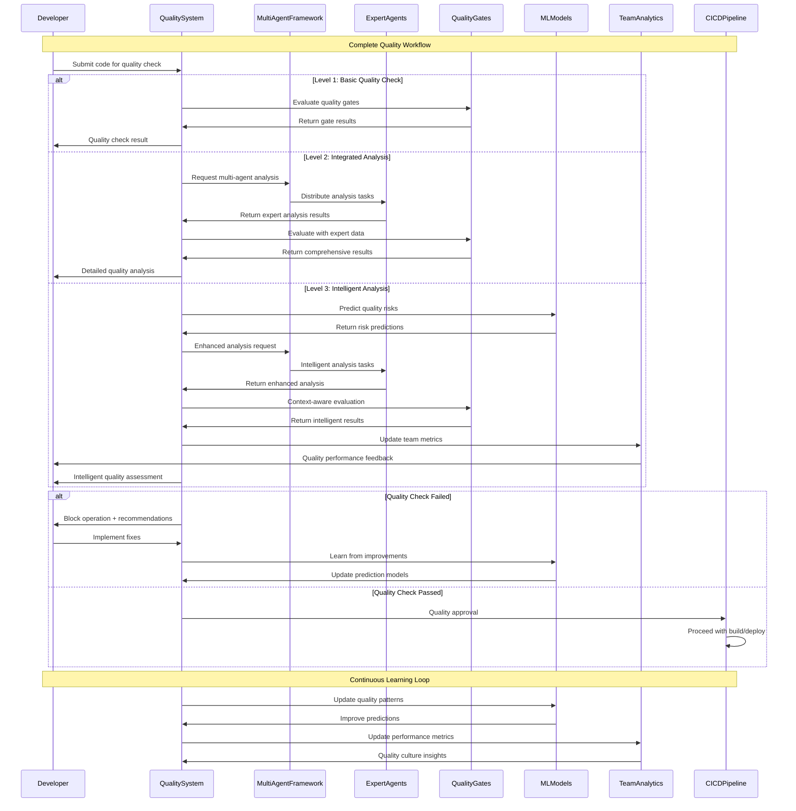

# Complete Quality System Architecture

## 🎯 **System Evolution Overview**

The Quality System evolves through four distinct maturity levels, each building upon the previous to create a comprehensive, intelligent quality management platform.

### **Evolution Timeline**
- **Phase 1-2** ✅ **COMPLETED**: Foundation & Core Implementation
- **Phase 3** 🚧 **IN PROGRESS**: Integration & Testing  
- **Phase 4** 🎯 **PLANNED**: Optimization & Scaling
- **Future** 🌟 **VISION**: Enterprise Quality Ecosystem

## 🏗️ **Complete System Architecture**

### **Level 1: Foundation Architecture** ✅ (Completed)
```
┌─────────────────────────────────────────────────────────────┐
│                    Quality System Foundation                │
├─────────────────────────────────────────────────────────────┤
│  ┌─────────────────┐  ┌─────────────────┐  ┌─────────────┐ │
│  │ QualityMetrics  │  │ QualityGates    │  │ Quality    │ │
│  │                 │  │                 │  │ Enforcer   │ │
│  │ • Score calc    │  │ • Thresholds    │  │            │ │
│  │ • Weighting     │  │ • Severity      │  │ • Coord    │ │
│  │ • History       │  │ • Blocking      │  │ • Report   │ │
│  └─────────────────┘  └─────────────────┘  └─────────────┘ │
│           │                    │                    │       │
│           └────────────────────┼────────────────────┘       │
│                                │                            │
│  ┌─────────────────────────────────────────────────────────┐ │
│  │                Integration Layer                        │ │
│  │  ┌─────────────────┐  ┌─────────────────┐              │ │
│  │  │ PreCommit       │  │ CI/CD           │              │ │
│  │  │ Integration     │  │ Integration     │              │ │
│  │  │                 │  │                 │              │ │
│  │  │ • Git hooks     │  │ • Pipeline     │              │ │
│  │  │ • Staged files  │  │ • Build gates  │              │ │
│  │  │ • Quality check │  │ • Quality fail │              │ │
│  │  └─────────────────┘  └─────────────────┘              │ │
│  └─────────────────────────────────────────────────────────┘ │
└─────────────────────────────────────────────────────────────┘
```

### **Level 2: Integrated Architecture** 🚧 (Phase 3)
```
┌─────────────────────────────────────────────────────────────────────┐
│                    Integrated Quality System                        │
├─────────────────────────────────────────────────────────────────────┤
│  ┌─────────────────┐  ┌─────────────────┐  ┌─────────────────┐     │
│  │ QualitySystem   │  │ MultiAgent      │  │ CI/CD          │     │
│  │                 │  │ Framework       │  │ Pipeline       │     │
│  │ • Core engine   │  │                 │  │                │     │
│  │ • Gate mgmt     │  │ • Orchestrator  │  │ • Quality      │     │
│  │ • Metrics       │  │ • Expert agents │  │   gates        │     │
│  │ • Enforcement   │  │ • Analysis      │  │ • Build        │     │
│  └─────────────────┘  │   coordination  │  │   blocking     │     │
│           │            └─────────────────┘  └─────────────────┘     │
│           │                    │                    │               │
│           └────────────────────┼────────────────────┘               │
│                                │                                  │
│  ┌─────────────────────────────────────────────────────────────┐   │
│  │                Expert Agent Integration                     │   │
│  │  ┌─────────────┐  ┌─────────────┐  ┌─────────────┐        │   │
│  │  │ Security    │  │ CodeQuality │  │ DevOps      │        │   │
│  │  │ Expert      │  │ Expert      │  │ Expert      │        │   │
│  │  │             │  │             │  │             │        │   │
│  │  │ • Security  │  │ • Linting   │  │ • CI/CD     │        │   │
│  │  │   analysis  │  │ • Coverage  │  │ • Infra     │        │   │
│  │  │ • Credential│  │ • Standards │  │ • Deploy    │        │   │
│  │  │   checks    │  │ • Best      │  │ • Security  │        │   │
│  │  └─────────────┘  │   practices │  │   config    │        │   │
│  │                   └─────────────┘  └─────────────┘        │   │
│  └─────────────────────────────────────────────────────────────┘   │
└─────────────────────────────────────────────────────────────────────┘
```

### **Level 3: Intelligent Architecture** 🎯 (Phase 4)
```
┌─────────────────────────────────────────────────────────────────────┐
│                    Intelligent Quality System                       │
├─────────────────────────────────────────────────────────────────────┤
│  ┌─────────────────┐  ┌─────────────────┐  ┌─────────────────┐     │
│  │ Intelligent     │  │ Quality         │  │ Team Quality    │     │
│  │ QualitySystem   │  │ Predictor       │  │ Analytics       │     │
│  │                 │  │                 │  │                 │     │
│  │ • Core engine   │  │ • ML Models     │  │ • Team metrics  │     │
│  │ • Adaptive      │  │ • Risk analysis │  │ • Individual    │     │
│  │   gates         │  │ • Forecasting   │  │   performance   │     │
│  │ • Optimization  │  │ • Prevention    │  │ • Culture       │     │
│  │ • Learning      │  │ • Patterns      │  │   measurement   │     │
│  └─────────────────┘  └─────────────────┘  └─────────────────┘     │
│           │                    │                    │               │
│           └────────────────────┼────────────────────┘               │
│                                │                                  │
│  ┌─────────────────────────────────────────────────────────────┐   │
│  │                Advanced Quality Features                     │   │
│  │  ┌─────────────┐  ┌─────────────┐  ┌─────────────┐        │   │
│  │  │ Quality     │  │ Advanced    │  │ Quality     │        │   │
│  │  │ Optimizer   │  │ Quality     │  │ Improvement │        │   │
│  │  │             │  │ Gates       │  │ Engine      │        │   │
│  │  │ • Auto-tune │  │ • Adaptive  │  │ • Auto-fix  │        │   │
│  │  │ • Weights   │  │   thresholds│  │ • Tracking  │        │   │
│  │  │ • Strategy  │  │ • Context   │  │ • Learning  │        │   │
│  │  │ • Learning  │  │   aware     │  │ • Validation│        │   │
│  │  └─────────────┘  │ • Intelligent│  └─────────────┘        │   │
│  │                   │   blocking  │                          │   │
│  │                   └─────────────┘                          │   │
│  └─────────────────────────────────────────────────────────────┘   │
└─────────────────────────────────────────────────────────────────────┘
```

### **Level 4: Enterprise Architecture** 🌟 (Future Vision)
```
┌─────────────────────────────────────────────────────────────────────┐
│                    Enterprise Quality Ecosystem                     │
├─────────────────────────────────────────────────────────────────────┤
│  ┌─────────────────┐  ┌─────────────────┐  ┌─────────────────┐     │
│  │ Enterprise      │  │ Cross-Org       │  │ Quality        │     │
│  │ QualitySystem   │  │ Quality         │  │ Culture        │     │
│  │                 │  │ Management      │  │ Platform       │     │
│  │ • Multi-tenant  │  │                 │  │                │     │
│  │ • Scalable      │  │ • Benchmarking  │  │ • Mindset      │     │
│  │ • Secure        │  │ • Comparison    │  │   training     │     │
│  │ • Compliant     │  │ • Standards     │  │ • Knowledge    │     │
│  │ • Auditable     │  │ • Compliance    │  │   sharing      │     │
│  └─────────────────┘  └─────────────────┘  └─────────────────┘     │
│           │                    │                    │               │
│           └────────────────────┼────────────────────┘               │
│                                │                                  │
│  ┌─────────────────────────────────────────────────────────────┐   │
│  │                Enterprise Quality Services                   │   │
│  │  ┌─────────────┐  ┌─────────────┐  ┌─────────────┐        │   │
│  │  │ Quality     │  │ Quality     │  │ Quality     │        │   │
│  │  │ Governance  │  │ Compliance  │  │ ROI         │        │   │
│  │  │             │  │             │  │ Analytics   │        │   │
│  │  │ • Policies  │  │ • Audits    │  │ • Business  │        │   │
│  │  │ • Standards │  │ • Reports   │  │   impact    │        │   │
│  │  │ • Processes │  │ • Cert      │  │ • Cost      │        │   │
│  │  │ • Controls  │  │ • Validation│  │   analysis  │        │   │
│  │  └─────────────┘  └─────────────┘  └─────────────┘        │   │
│  └─────────────────────────────────────────────────────────────┘   │
└─────────────────────────────────────────────────────────────────────┘
```

## 🔄 **Complete System Communication Flow**



## 🎭 **Complete System Use Case Overview**

```mermaid
graph TB
    subgraph "Foundation Use Cases (Level 1)"
        UC1[Run Quality Check]
        UC2[Evaluate Quality Gates]
        UC3[Generate Quality Report]
        UC4[Track Quality Trends]
        UC5[Configure Quality Thresholds]
    end
    
    subgraph "Integration Use Cases (Level 2)"
        UC6[Trigger Multi-Agent Analysis]
        UC7[Collect Expert Recommendations]
        UC8[Integrate Analysis Results]
        UC9[Validate Quality Improvements]
        UC10[Automate CI/CD Quality Checks]
    end
    
    subgraph "Intelligence Use Cases (Level 3)"
        UC11[Predict Quality Issues]
        UC12[Optimize Quality Gates]
        UC13[Intelligent Blocking]
        UC14[Generate Automated Fixes]
        UC15[Analyze Team Performance]
    end
    
    subgraph "Enterprise Use Cases (Level 4)"
        UC16[Multi-Project Quality Management]
        UC17[Cross-Organization Quality]
        UC18[Quality Governance]
        UC19[Quality Compliance]
        UC20[Quality ROI Analysis]
    end
    
    subgraph "Actors"
        Developer
        QualityEngineer
        TeamLead
        DevOpsEngineer
        QualityManager
        MLSystem
        Enterprise
    end
    
    Developer --> UC1
    Developer --> UC6
    Developer --> UC11
    Developer --> UC14
    
    QualityEngineer --> UC2
    QualityEngineer --> UC3
    QualityEngineer --> UC12
    QualityEngineer --> UC13
    
    TeamLead --> UC7
    TeamLead --> UC8
    TeamLead --> UC15
    
    DevOpsEngineer --> UC9
    DevOpsEngineer --> UC10
    
    QualityManager --> UC16
    QualityManager --> UC17
    QualityManager --> UC18
    QualityManager --> UC19
    QualityManager --> UC20
    
    MLSystem --> UC11
    MLSystem --> UC12
    MLSystem --> UC13
    MLSystem --> UC14
    
    Enterprise --> UC16
    Enterprise --> UC17
    Enterprise --> UC18
    Enterprise --> UC19
    Enterprise --> UC20
```



## 📊 **System Maturity Metrics**

### **Level 1: Foundation** ✅ (Completed)
- **Quality Gates**: Basic threshold enforcement
- **Metrics**: Simple scoring (0-100)
- **Integration**: Pre-commit and CI/CD hooks
- **Performance**: <5 seconds for quality checks
- **Scalability**: Single project support

### **Level 2: Integration** 🚧 (Phase 3)
- **Quality Gates**: Multi-agent enhanced evaluation
- **Metrics**: Expert-weighted quality scoring
- **Integration**: Full multi-agent framework
- **Performance**: <3 seconds for quality checks
- **Scalability**: Multi-project support

### **Level 3: Intelligence** 🎯 (Phase 4)
- **Quality Gates**: Adaptive, context-aware
- **Metrics**: ML-enhanced predictive scoring
- **Integration**: Machine learning models
- **Performance**: <2 seconds for quality checks
- **Scalability**: Enterprise project support

### **Level 4: Enterprise** 🌟 (Future)
- **Quality Gates**: Governance and compliance
- **Metrics**: Business impact and ROI
- **Integration**: Enterprise systems
- **Performance**: Sub-second for cached operations
- **Scalability**: Multi-organization support

## 🔧 **Implementation Roadmap**

### **Phase 3: Integration & Testing** (Current)
- **Duration**: 4-6 weeks
- **Focus**: Multi-agent integration and CI/CD pipeline
- **Deliverables**: Working integrated quality system
- **Success Criteria**: All integration points functional

### **Phase 4: Optimization & Scaling** (Next)
- **Duration**: 6-8 weeks
- **Focus**: Performance optimization and ML integration
- **Deliverables**: Intelligent quality platform
- **Success Criteria**: Performance targets met, ML models trained

### **Future Phases** (Vision)
- **Enterprise Features**: 8-12 weeks
- **Quality Culture Platform**: 12-16 weeks
- **Cross-Organization**: 16-20 weeks

## 📝 **Technical Implementation Notes**

### **Key Architectural Decisions**
1. **Modular Design**: Each level builds upon the previous without breaking changes
2. **Plugin Architecture**: Expert agents and ML models can be added/removed
3. **Performance First**: Quality checks must be fast for developer productivity
4. **Learning System**: Continuous improvement through ML and feedback loops

### **Integration Patterns**
- **Event-Driven**: Quality events trigger appropriate actions
- **Async Processing**: Non-blocking quality analysis for performance
- **Caching Strategy**: Multi-level caching for optimal performance
- **Fallback Mechanisms**: Graceful degradation when components fail

### **Quality Metrics Evolution**
- **Basic**: Simple numerical scores (0-100)
- **Enhanced**: Weighted expert-based scoring
- **Intelligent**: ML-predicted quality trends
- **Enterprise**: Business impact and ROI metrics

This architecture provides a clear path from basic quality enforcement to a comprehensive, intelligent quality management platform that scales from individual developers to enterprise organizations.
