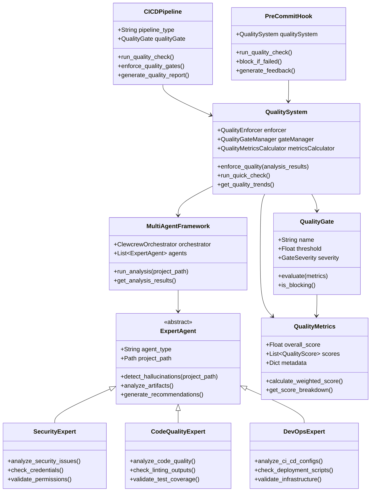
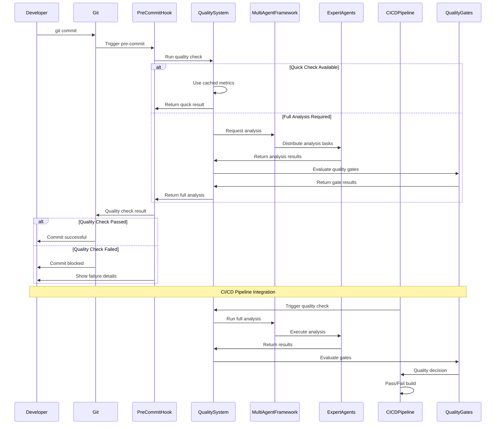

# Phase 3: CHECK - Integration & Testing

## 🎯 **Objective**

Integrate the quality system with the multi-agent testing framework, connect to CI/CD pipelines, and validate the complete quality automation workflow through comprehensive testing.

## 🏗️ **Architecture Overview**

### **System Integration Architecture**

The quality system integrates with three major components:

1. **Multi-Agent Testing Framework** - Core orchestration and expert agents
2. **CI/CD Pipeline** - Automated quality enforcement in build processes
3. **Quality Enforcement Engine** - Central quality management and gates

### **Integration Points**

- **Pre-commit Hooks** → Quality gates before code commits
- **CI/CD Triggers** → Quality enforcement during builds
- **Multi-Agent Analysis** → Quality metrics from expert analysis
- **Quality Dashboard** → Real-time quality monitoring and reporting

## 📊 **UML Static Structure Diagram**

## 🔄 **UML Communication Diagram**

## 🎭 **UML Use Case Diagram**

```mermaid
graph TB
    subgraph "Quality System Use Cases"
        UC1[Run Quality Check]
        UC2[Evaluate Quality Gates]
        UC3[Generate Quality Report]
        UC4[Track Quality Trends]
        UC5[Configure Quality Thresholds]
    end
    
    subgraph "Multi-Agent Integration Use Cases"
        UC6[Trigger Multi-Agent Analysis]
        UC7[Collect Expert Recommendations]
        UC8[Integrate Analysis Results]
        UC9[Validate Quality Improvements]
    end
    
    subgraph "CI/CD Integration Use Cases"
        UC10[Automate Quality Checks]
        UC11[Block Failed Builds]
        UC12[Generate Quality Reports]
        UC13[Track Build Quality]
    end
    
    subgraph "Pre-commit Integration Use Cases"
        UC14[Pre-commit Quality Check]
        UC15[Block Failed Commits]
        UC16[Provide Quality Feedback]
        UC17[Install Quality Hooks]
    end
    
    subgraph "Quality Monitoring Use Cases"
        UC18[Monitor Quality Metrics]
        UC19[Alert Quality Issues]
        UC20[Generate Quality Dashboards]
        UC21[Track Quality Trends]
    end
    
    subgraph "Actors"
        Developer
        DevOpsEngineer
        QualityEngineer
        System
        CICDPipeline
    end
    
    Developer --> UC1
    Developer --> UC14
    Developer --> UC15
    Developer --> UC16
    Developer --> UC17
    
    DevOpsEngineer --> UC10
    DevOpsEngineer --> UC11
    DevOpsEngineer --> UC12
    DevOpsEngineer --> UC13
    
    QualityEngineer --> UC5
    QualityEngineer --> UC18
    QualityEngineer --> UC19
    QualityEngineer --> UC20
    QualityEngineer --> UC21
    
    System --> UC2
    System --> UC3
    System --> UC4
    System --> UC6
    System --> UC7
    System --> UC8
    System --> UC9
    
    CICDPipeline --> UC10
    CICDPipeline --> UC11
    CICDPipeline --> UC12
    CICDPipeline --> UC13
```

## 🔧 **Implementation Tasks**

### **3.1 Multi-Agent Framework Integration**

- [ ] **Create Integration Adapter**
  - Bridge between quality system and multi-agent framework
  - Convert expert agent outputs to quality metrics
  - Handle asynchronous analysis coordination
  
- [ ] **Expert Agent Quality Mapping**
  - Map SecurityExpert outputs to security quality metrics
  - Map CodeQualityExpert outputs to code quality metrics
  - Map DevOpsExpert outputs to operational quality metrics
  
- [ ] **Analysis Result Aggregation**
  - Combine results from multiple expert agents
  - Weight and prioritize different quality aspects
  - Generate unified quality assessment

### **3.2 CI/CD Pipeline Integration**

- [ ] **Pipeline Quality Gates**
  - Integrate quality checks into build processes
  - Configure quality thresholds for different environments
  - Implement quality-based build blocking
  
- [ ] **Quality Reporting in CI/CD**
  - Generate quality reports as build artifacts
  - Integrate with CI/CD dashboards
  - Provide quality metrics for deployment decisions
  
- [ ] **Environment-Specific Quality Rules**
  - Different quality standards for dev/staging/prod
  - Progressive quality enforcement through pipeline stages
  - Quality-based promotion gates

### **3.3 Round-Trip Code Generation Testing**

- [ ] **Quality Improvement Validation**
  - Test that fixes actually improve quality scores
  - Validate that no new issues are introduced
  - Measure quality improvement effectiveness
  
- [ ] **Automated Quality Regression Testing**
  - Detect quality score degradation
  - Identify quality regression patterns
  - Prevent quality backsliding
  
- [ ] **Quality Improvement Recommendations**
  - Generate actionable improvement suggestions
  - Prioritize quality improvements by impact
  - Track improvement implementation

### **3.4 Quality Improvement Cycle Validation**

- [ ] **End-to-End Quality Workflow**
  - Test complete quality improvement cycle
  - Validate quality gate effectiveness
  - Measure quality improvement velocity
  
- [ ] **Quality Metrics Accuracy**
  - Validate quality score calculations
  - Test quality gate threshold accuracy
  - Ensure quality metrics consistency
  
- [ ] **Performance and Scalability**
  - Test quality system performance under load
  - Validate scalability for large projects
  - Optimize quality check execution time

## 🧪 **Testing Strategy**

### **Integration Testing**

- **Multi-Agent Integration Tests**
  - Test quality system with real expert agents
  - Validate analysis result processing
  - Test asynchronous coordination
  
- **CI/CD Integration Tests**
  - Test quality gates in actual CI/CD pipelines
  - Validate build blocking behavior
  - Test quality reporting integration
  
- **Pre-commit Integration Tests**
  - Test quality hooks in git workflows
  - Validate commit blocking behavior
  - Test quality feedback generation

### **End-to-End Testing**

- **Complete Quality Workflow**
  - Test full quality improvement cycle
  - Validate quality gate enforcement
  - Test quality metrics tracking
  
- **Quality Improvement Validation**
  - Test that fixes improve quality scores
  - Validate quality regression prevention
  - Test quality improvement recommendations

### **Performance Testing**

- **Quality Check Performance**
  - Measure quality check execution time
  - Test quality system scalability
  - Optimize performance bottlenecks
  
- **Multi-Agent Coordination**
  - Test expert agent coordination efficiency
  - Validate parallel analysis performance
  - Test result aggregation performance

## 📊 **Success Metrics**

### **Integration Success Criteria**

- [ ] Multi-agent framework integration working
- [ ] CI/CD pipeline integration functional
- [ ] Pre-commit hooks integrated and working
- [ ] Quality gates enforcing in all environments

### **Testing Success Criteria**

- [ ] Round-trip code generation tested
- [ ] Quality improvement cycles validated
- [ ] Performance targets met
- [ ] Quality metrics accuracy verified

### **Quality Improvement Success Criteria**

- [ ] Quality scores improving over time
- [ ] Quality gates preventing quality degradation
- [ ] Quality recommendations actionable and effective
- [ ] Quality improvement velocity measurable

## 🚀 **Next Steps After Phase 3**

### **Phase 4: ACT - Optimization & Scaling**

- Performance optimization and advanced features
- Team quality metrics and reporting
- Quality improvement recommendations
- Advanced quality analytics

### **Quality System Maturity**

- Production-ready quality enforcement
- Comprehensive quality monitoring
- Automated quality improvement
- Quality culture establishment

---

## 📝 **Implementation Notes**

### **Key Integration Challenges**

1. **Asynchronous Coordination** - Expert agents may have different execution times
2. **Data Format Consistency** - Ensuring expert outputs map to quality metrics
3. **Performance Optimization** - Quality checks must be fast for pre-commit hooks
4. **Error Handling** - Graceful degradation when components fail

### **Quality Gate Configuration**

- **Development Environment**: Lenient gates for rapid iteration
- **Staging Environment**: Moderate gates for validation
- **Production Environment**: Strict gates for quality assurance

### **Multi-Agent Quality Mapping**

- **SecurityExpert** → Security quality score (weight: 3.0)
- **CodeQualityExpert** → Code quality score (weight: 2.0)
- **DevOpsExpert** → Operational quality score (weight: 1.5)
- **TestExpert** → Test coverage score (weight: 1.5)
- **ArchitectureExpert** → Architecture quality score (weight: 1.0)

This phase establishes the foundation for a fully integrated, automated quality system that continuously improves code quality through intelligent analysis and enforcement.
