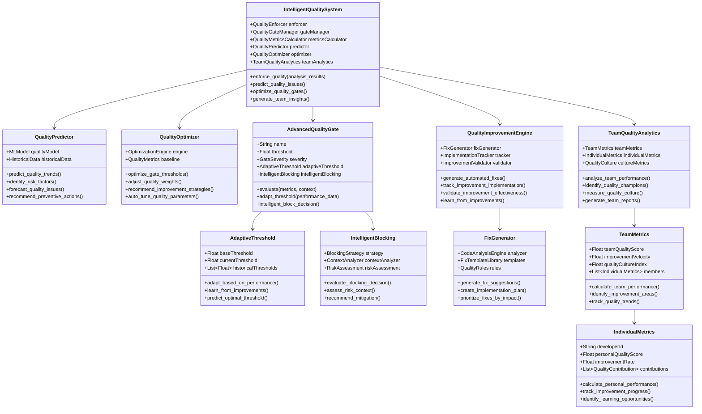
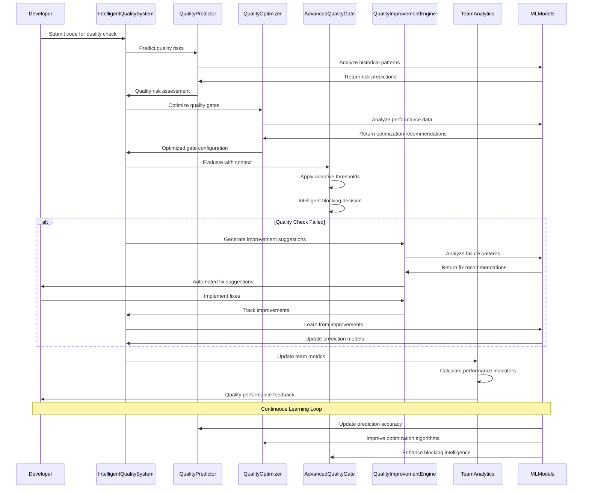

# Phase 4: ACT - Optimization & Scaling

## 🎯 **Objective**
Optimize the quality system performance, implement advanced features, and scale the system to support enterprise-level quality management with comprehensive team metrics and intelligent quality improvement recommendations.

## 🚀 **Advanced Architecture Overview**

### **System Evolution**
The quality system evolves from a basic enforcement tool to an intelligent quality management platform that:
- **Learns** from quality patterns and improvement cycles
- **Adapts** quality gates based on project maturity and team performance
- **Predicts** quality issues before they occur
- **Recommends** optimal quality improvement strategies

### **Advanced Integration Points**
- **Machine Learning Models** → Quality prediction and optimization
- **Team Performance Analytics** → Quality culture metrics
- **Advanced Quality Gates** → Adaptive thresholds and intelligent blocking
- **Quality Improvement Engine** → Automated fix suggestions and implementation

## 📊 **Advanced UML Static Structure Diagram**

## 🔄 **Advanced UML Communication Diagram**

## 🎭 **Advanced UML Use Case Diagram**

```mermaid
graph TB
    subgraph "Intelligent Quality Management"
        UC1[Predict Quality Issues]
        UC2[Optimize Quality Gates]
        UC3[Intelligent Blocking]
        UC4[Adaptive Thresholds]
        UC5[Quality Risk Assessment]
    end
    
    subgraph "Advanced Quality Improvement"
        UC6[Generate Automated Fixes]
        UC7[Track Improvement Implementation]
        UC8[Validate Improvement Effectiveness]
        UC9[Learn from Improvements]
        UC10[Prioritize Fixes by Impact]
    end
    
    subgraph "Team Quality Analytics"
        UC11[Analyze Team Performance]
        UC12[Identify Quality Champions]
        UC13[Measure Quality Culture]
        UC14[Generate Team Reports]
        UC15[Track Individual Progress]
    end
    
    subgraph "Machine Learning Integration"
        UC16[Train Quality Models]
        UC17[Update Prediction Algorithms]
        UC18[Optimize Quality Parameters]
        UC19[Learn from Quality Patterns]
        UC20[Adapt to Project Evolution]
    end
    
    subgraph "Enterprise Quality Management"
        UC21[Multi-Project Quality Tracking]
        UC22[Cross-Team Quality Comparison]
        UC23[Quality Benchmarking]
        UC24[Quality Compliance Reporting]
        UC25[Quality ROI Analysis]
    end
    
    subgraph "Actors"
        Developer
        QualityEngineer
        TeamLead
        DevOpsEngineer
        QualityManager
        MLSystem
    end
    
    Developer --> UC1
    Developer --> UC6
    Developer --> UC7
    Developer --> UC15
    
    QualityEngineer --> UC2
    QualityEngineer --> UC3
    QualityEngineer --> UC4
    QualityEngineer --> UC5
    
    TeamLead --> UC11
    TeamLead --> UC12
    TeamLead --> UC13
    TeamLead --> UC14
    
    DevOpsEngineer --> UC8
    DevOpsEngineer --> UC9
    DevOpsEngineer --> UC10
    
    QualityManager --> UC21
    QualityManager --> UC22
    QualityManager --> UC23
    QualityManager --> UC24
    QualityManager --> UC25
    
    MLSystem --> UC16
    MLSystem --> UC17
    MLSystem --> UC18
    MLSystem --> UC19
    MLSystem --> UC20
```

## 🔧 **Advanced Implementation Tasks**

### **4.1 Performance Optimization**
- [ ] **Quality Check Optimization**
  - Implement parallel quality analysis
  - Cache frequently accessed quality data
  - Optimize quality gate evaluation algorithms
  - Reduce quality check execution time to <2 seconds
  
- [ ] **Scalability Improvements**
  - Support for large-scale projects (1000+ files)
  - Distributed quality analysis across multiple workers
  - Horizontal scaling of quality enforcement
  - Memory optimization for quality metrics storage
  
- [ ] **Advanced Caching Strategies**
  - Intelligent cache invalidation based on code changes
  - Multi-level caching (memory, disk, distributed)
  - Predictive caching for frequently accessed quality data
  - Cache performance monitoring and optimization

### **4.2 Advanced Quality Features**
- [ ] **Intelligent Quality Gates**
  - Adaptive thresholds based on project maturity
  - Context-aware blocking decisions
  - Risk-based quality enforcement
  - Predictive quality issue detection
  
- [ ] **Quality Prediction Engine**
  - ML-based quality trend prediction
  - Risk factor identification and analysis
  - Quality issue forecasting
  - Preventive quality action recommendations
  
- [ ] **Advanced Quality Metrics**
  - Composite quality indicators
  - Quality velocity and acceleration metrics
  - Quality debt tracking and analysis
  - Quality ROI and business impact metrics

### **4.3 Team Quality Analytics**
- [ ] **Team Performance Metrics**
  - Individual developer quality scores
  - Team quality improvement velocity
  - Quality culture measurement
  - Quality champion identification
  
- [ ] **Quality Culture Analytics**
  - Quality mindset assessment
  - Quality practice adoption tracking
  - Quality knowledge sharing metrics
  - Quality improvement motivation analysis
  
- [ ] **Advanced Reporting**
  - Executive quality dashboards
  - Team quality performance reports
  - Quality trend analysis and forecasting
  - Quality compliance and audit reporting

### **4.4 Machine Learning Integration**
- [ ] **Quality Prediction Models**
  - Train models on historical quality data
  - Predict quality issues before they occur
  - Identify quality improvement opportunities
  - Forecast quality trends and patterns
  
- [ ] **Intelligent Optimization**
  - Auto-tune quality gate thresholds
  - Optimize quality metric weights
  - Adapt quality enforcement strategies
  - Learn from quality improvement cycles
  
- [ ] **Continuous Learning**
  - Update models based on new quality data
  - Adapt to project evolution and changes
  - Improve prediction accuracy over time
  - Learn from quality success and failure patterns

## 🧪 **Advanced Testing Strategy**

### **Performance Testing**
- **Load Testing**
  - Test quality system under high load (1000+ concurrent users)
  - Measure quality check response times under load
  - Validate quality system scalability limits
  - Test quality system resource utilization
  
- **Stress Testing**
  - Test quality system behavior under extreme conditions
  - Validate quality system stability under stress
  - Test quality system recovery from failures
  - Measure quality system degradation patterns

### **Machine Learning Testing**
- **Model Accuracy Testing**
  - Validate quality prediction accuracy
  - Test quality optimization effectiveness
  - Measure quality improvement recommendations accuracy
  - Test quality model generalization
  
- **Learning Validation**
  - Test continuous learning effectiveness
  - Validate model adaptation to new data
  - Test quality model evolution over time
  - Measure learning algorithm performance

### **Enterprise Testing**
- **Multi-Project Testing**
  - Test quality system with multiple projects
  - Validate cross-project quality comparison
  - Test quality system resource sharing
  - Validate multi-project quality management
  
- **Team Performance Testing**
  - Test team quality analytics accuracy
  - Validate individual performance tracking
  - Test quality culture measurement
  - Validate team quality reporting

## 📊 **Advanced Success Metrics**

### **Performance Success Criteria**
- [ ] Quality check execution time <2 seconds
- [ ] Support for 1000+ file projects
- [ ] 99.9% system uptime
- [ ] Sub-second response time for cached operations

### **Intelligence Success Criteria**
- [ ] Quality prediction accuracy >85%
- [ ] Quality optimization effectiveness >90%
- [ ] Quality improvement recommendations actionable >95%
- [ ] Quality model learning rate measurable

### **Enterprise Success Criteria**
- [ ] Multi-project quality management functional
- [ ] Team quality analytics accurate and actionable
- [ ] Quality culture measurement effective
- [ ] Quality ROI analysis comprehensive

## 🚀 **Quality System Maturity Levels**

### **Level 1: Basic Quality Enforcement** ✅ (Completed)
- Quality gates and basic enforcement
- Simple quality metrics and scoring
- Basic quality reporting

### **Level 2: Integrated Quality Management** 🚧 (Phase 3)
- Multi-agent integration
- CI/CD pipeline integration
- Comprehensive quality testing

### **Level 3: Intelligent Quality Platform** 🎯 (Phase 4)
- ML-based quality prediction
- Adaptive quality gates
- Intelligent quality optimization

### **Level 4: Enterprise Quality Ecosystem** 🌟 (Future)
- Cross-organization quality management
- Advanced quality analytics
- Quality culture transformation

## 📝 **Advanced Implementation Notes**

### **Key Technical Challenges**
1. **ML Model Training** - Requires substantial historical quality data
2. **Performance Optimization** - Balancing accuracy with speed
3. **Scalability** - Supporting enterprise-level quality management
4. **Integration Complexity** - Coordinating multiple advanced systems

### **Quality Intelligence Features**
- **Predictive Quality Gates** - Adapt thresholds based on predicted quality trends
- **Risk-Based Enforcement** - Apply quality gates based on risk assessment
- **Context-Aware Blocking** - Consider project context in blocking decisions
- **Intelligent Recommendations** - Suggest quality improvements based on ML analysis

### **Team Quality Culture Metrics**
- **Quality Mindset Index** - Measure team quality awareness and commitment
- **Quality Practice Adoption** - Track quality tool and process usage
- **Quality Knowledge Sharing** - Measure quality knowledge dissemination
- **Quality Improvement Motivation** - Assess team drive for quality improvement

This phase transforms the quality system from a basic enforcement tool into an intelligent quality management platform that continuously learns, adapts, and optimizes quality processes for maximum effectiveness.
