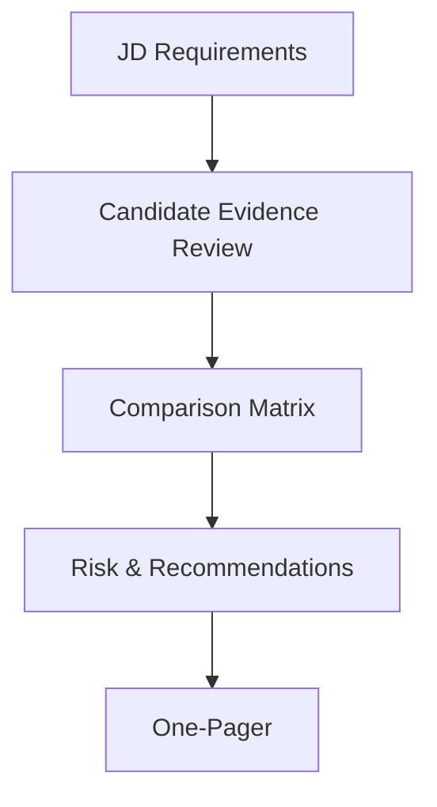
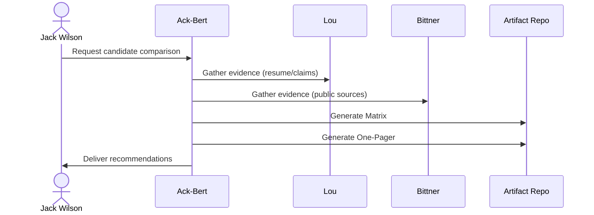

# Ack-Bert Session One-Pager — Candidate Comparison & Ontology

**Date:** 2025-09-03

This document captures the **procedure**, **ontology**, and **visual models** for the Lou vs. John H. F. Bittner II comparison aligned to the Ack‑Bert method.

______________________________________________________________________

## 1) Executive Summary

- **Lou** — Better fit now (pipelines/distribution + governance). Missing artifacts for **post‑training** and **multimodal**.
- **Bittner** — Strong **ontology/governance** with public validation. Missing **LLM training** and **multimodal** artifacts.

**Recommendation:** Advance **Lou** to technical screen; keep **Bittner** warm for governance lane.

______________________________________________________________________

## 2) Procedure (Ack‑Bert Mapping)

1. **JD Extraction** → enumerate requirements: training at scale, post‑training (RL/contrastive/IT), multimodal, governance, domain adjacency.
1. **Evidence Review** → evaluate each candidate; note strengths, gaps, and evidence strength level.
1. **Comparison Matrix & Risk** → synthesize head‑to‑head, call risks, and form recommendations.
1. **One‑Pager Packaging** → distill for hiring manager consumption.

**Traceability:** See ontology individuals `ab:ComparisonProcedure`, `art:ComparisonMatrix_2025_09_03`, and `art:OnePager_2025_09_03`.

______________________________________________________________________

## 3) Domain/Context Model (Mermaid)

```mermaid
classDiagram
  class Candidate {{
    +name: string
    +evidenceStrength: EvidenceStrength
    +strengths: JDRequirement[*]
    +gaps: JDRequirement[*]
  }}
  class EvidenceStrength {{
    +level: int
    +label: string
  }}
  class JDRequirement {{
    +name: string
  }}
  class Artifact {{
    +type: string
    +generatedBy: Procedure
  }}
  class Recommendation {{
    +action: string
    +comment: string
  }}
  class Procedure {{
    +steps: string
    +requestedBy: Stakeholder
    +performedBy: Stakeholder
  }}
  class Stakeholder {{
    +name: string
  }}

  Candidate --> JDRequirement : evaluatedAgainst
  Candidate --> EvidenceStrength : hasEvidenceStrength
  Candidate --> JDRequirement : showsStrength
  Candidate --> JDRequirement : lacksArtifact
  Artifact --> Candidate : concernsCandidate
  Artifact --> Recommendation : supportsRecommendation
  Artifact --> JDRequirement : targetsRequirement
  Artifact --> Procedure : generatedBy
  Procedure --> Stakeholder : requestedBy/performedBy
```

______________________________________________________________________

## 4) Dependency Model (Procedure Flow)



______________________________________________________________________

## 5) Object Interaction (Concept Design)



______________________________________________________________________

## 6) Ontology Snippet (TTL)

See full file: `ackbert-ontology.ttl`.

```ttl
@prefix ab: <http://example.org/ackbert#> .
@prefix cand: <http://example.org/candidate#> .
@prefix jd: <http://example.org/jd#> .

cand:Lou a ab:Candidate ;
  ab:hasEvidenceStrength ab:Level1 ;
  ab:showsStrength jd:LLMTraining, jd:Governance ;
  ab:lacksArtifact jd:PostTraining, jd:Multimodal .
```

______________________________________________________________________

## 7) How to Extend

- Add new candidates as `ab:Candidate` individuals.
- Attach run cards/eval harnesses as `ab:Artifact` with `prov:wasGeneratedBy` a Procedure.
- Promote evidence to **Level‑2** when partial demos exist; **Level‑3** when public/peer‑reviewed.

______________________________________________________________________

## 8) Files in This Bundle

- `ackbert-ontology.ttl` — the ontology with candidates, JD, artifacts, procedure, risk, and recommendations.
- `ackbert-one-pager.md` — this Markdown with embedded Mermaid diagrams.
