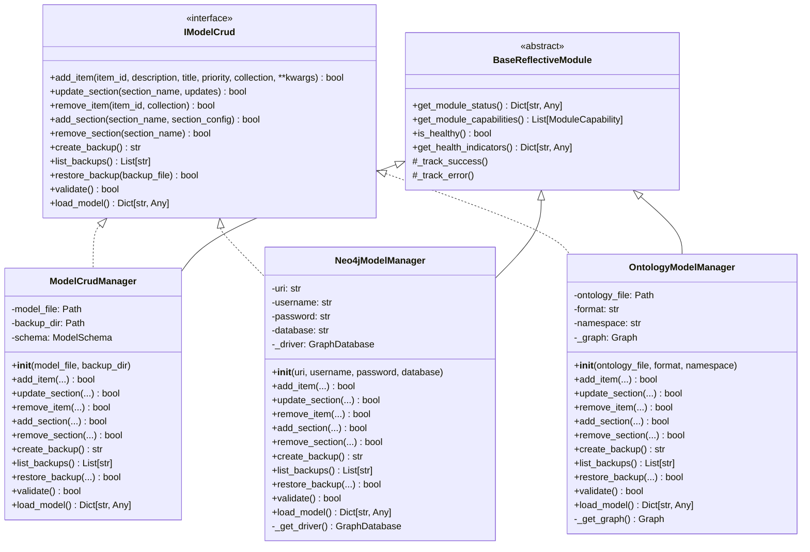
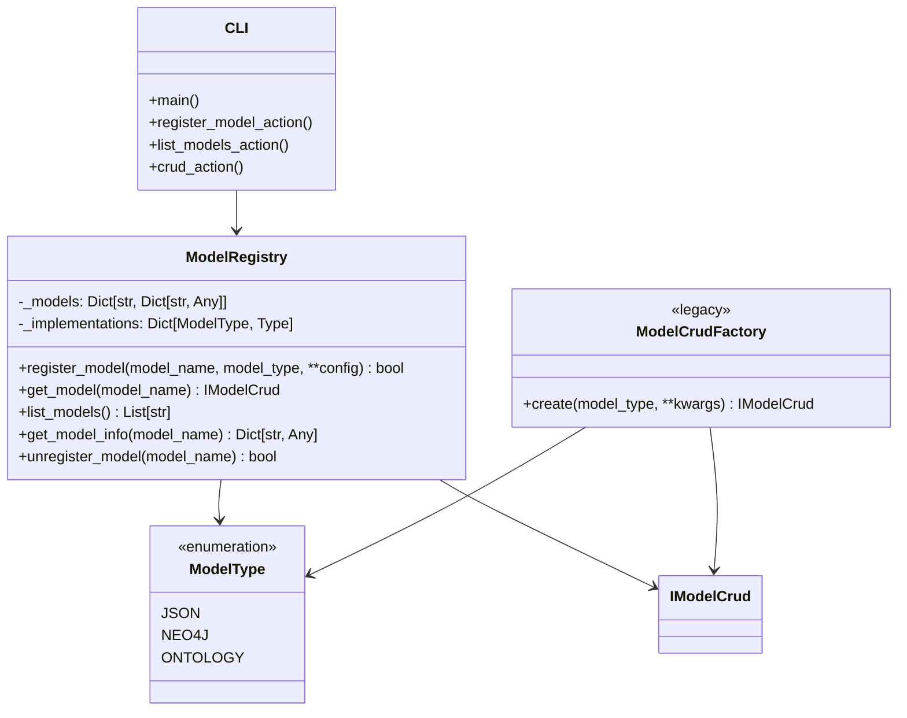
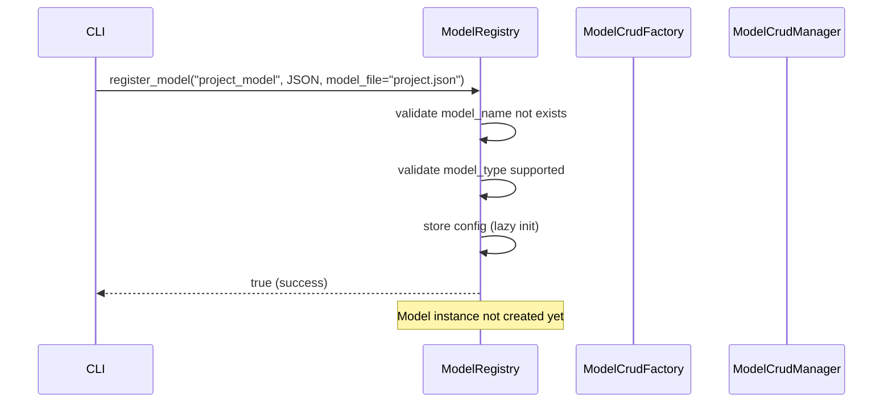
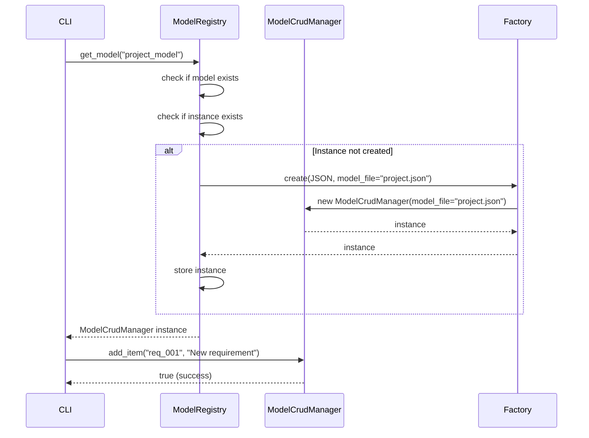
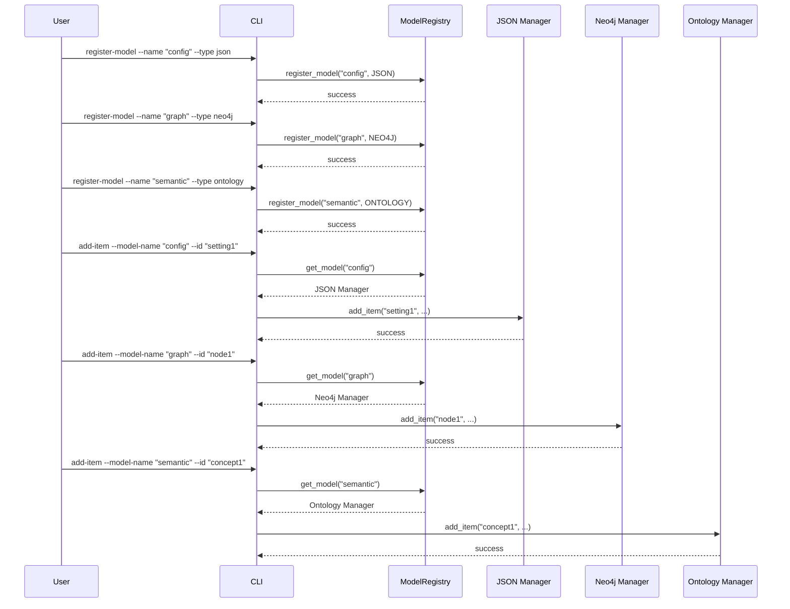
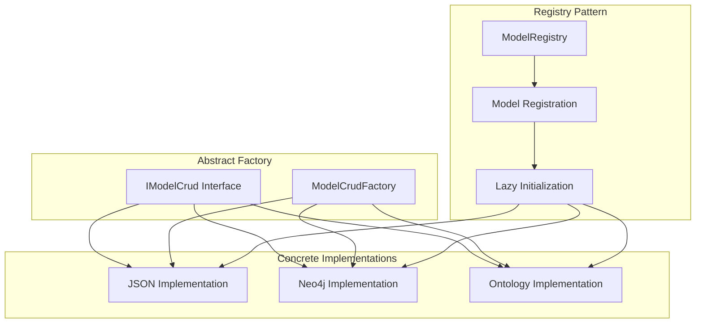
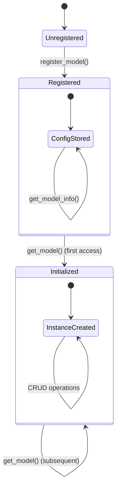
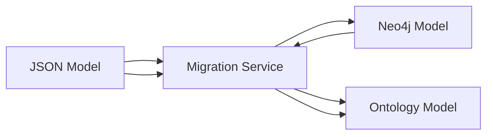

# Model CRUD System Design Document

## 🎯 Overview

The Model CRUD System provides a unified interface for managing models across different storage backends (JSON, Neo4j, Ontology/RDF) through an abstract factory pattern and model registry. This design ensures implementation details are hidden from users while maintaining flexibility and extensibility.

## 🏗️ Architecture Principles

### 1. **Interface Segregation**

- Single `IModelCrud` interface defines all CRUD operations
- All implementations must fully implement the interface
- No implementation details leak through the interface

### 2. **Model Registry Pattern**

- Models are registered by unique names at design time
- Implementation details are encapsulated in registration
- Users operate on models by name, not implementation type

### 3. **Lazy Initialization**

- Model instances are created only when first accessed
- Reduces memory footprint and startup time
- Supports dynamic model registration

### 4. **Reflective Module Compliance**

- All implementations inherit from `BaseReflectiveModule`
- Self-monitoring and operational visibility
- Standardized capability reporting

## 📊 Static Structure

### Core Interface Hierarchy



### Model Registry Architecture



## 🔄 Object Interaction Diagrams

### Model Registration Flow



### Model Access Flow



### Multi-Model CRUD Operations



## 🎨 Design Patterns

### 1. **Abstract Factory Pattern**



### 2. **Registry Pattern with Lazy Initialization**



## 🔧 Implementation Details

### Model Type Configuration

| Model Type | Configuration Parameters | Default Values |
|------------|-------------------------|----------------|
| JSON | `model_file`, `backup_dir` | `"model.json"`, `"backups"` |
| Neo4j | `uri`, `username`, `password`, `database` | `"bolt://localhost:7687"`, `"neo4j"`, `"password"`, `"neo4j"` |
| Ontology | `ontology_file`, `format`, `namespace` | `"model.ttl"`, `"turtle"`, `"http://example.org/model#"` |

### CLI Command Structure

```bash
# Model Registration
uv run python scripts/model_crud.py register-model --model-name "project" --model-type json --model-file project.json
uv run python scripts/model_crud.py register-model --model-name "graph" --model-type neo4j --uri bolt://localhost:7687
uv run python scripts/model_crud.py register-model --model-name "semantic" --model-type ontology --format turtle

# Model Management
uv run python scripts/model_crud.py list-models
uv run python scripts/model_crud.py unregister-model --model-name "project"

# CRUD Operations (same interface for all models)
uv run python scripts/model_crud.py add-item --model-name "project" --id "req_001" --description "New requirement"
uv run python scripts/model_crud.py update-section --model-name "project" --section "domains" --updates '{"python": {"linter": "flake8"}}'
uv run python scripts/model_crud.py validate --model-name "project"
```

## 🚀 Benefits of This Design

### 1. **Implementation Transparency**

- Users don't need to know about JSON, Neo4j, or RDF details
- Same CLI commands work across all model types
- Implementation can be changed without affecting user code

### 2. **Extensibility**

- New model types can be added by implementing `IModelCrud`
- Registry pattern allows dynamic model registration
- Factory pattern supports multiple implementations

### 3. **LCD (Lowest Common Denominator) Management**

- Interface defines the common operations all models must support
- Complex model-specific features are hidden behind the interface
- Users get consistent behavior across all model types

### 4. **Reflective Module Compliance**

- All implementations provide operational visibility
- Self-monitoring and health reporting
- Standardized capability discovery

## 🔮 Future Enhancements

### 1. **Model Migration**



### 2. **Model Synchronization**

- Real-time synchronization between different model types
- Event-driven updates across model instances
- Conflict resolution strategies

### 3. **Model Validation**

- Cross-model validation rules
- Schema validation for each model type
- Semantic validation for ontology models

### 4. **Performance Optimization**

- Connection pooling for Neo4j
- Caching strategies for JSON models
- Graph optimization for ontology models

## 📋 Implementation Checklist

- [x] Define `IModelCrud` interface
- [x] Implement JSON model manager
- [x] Implement Neo4j model manager
- [x] Implement Ontology model manager
- [x] Create ModelRegistry with lazy initialization
- [x] Implement CLI with model registry support
- [x] Add Reflective Module compliance
- [x] Create comprehensive design documentation
- [ ] Add unit tests for all implementations
- [ ] Add integration tests for model registry
- [ ] Add performance benchmarks
- [ ] Add migration utilities
- [ ] Add model validation framework

## 🎯 Conclusion

This design provides a robust, extensible, and user-friendly system for managing models across different storage backends. The abstract factory pattern combined with the model registry ensures that implementation details are properly encapsulated while maintaining flexibility and performance.

The LCD approach ensures that users can work with any model type using the same interface, while the reflective module compliance provides operational visibility and maintainability.
