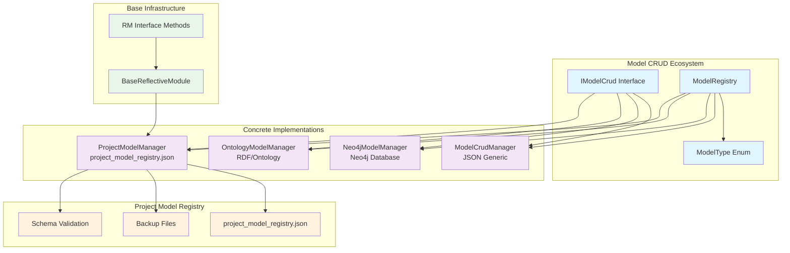
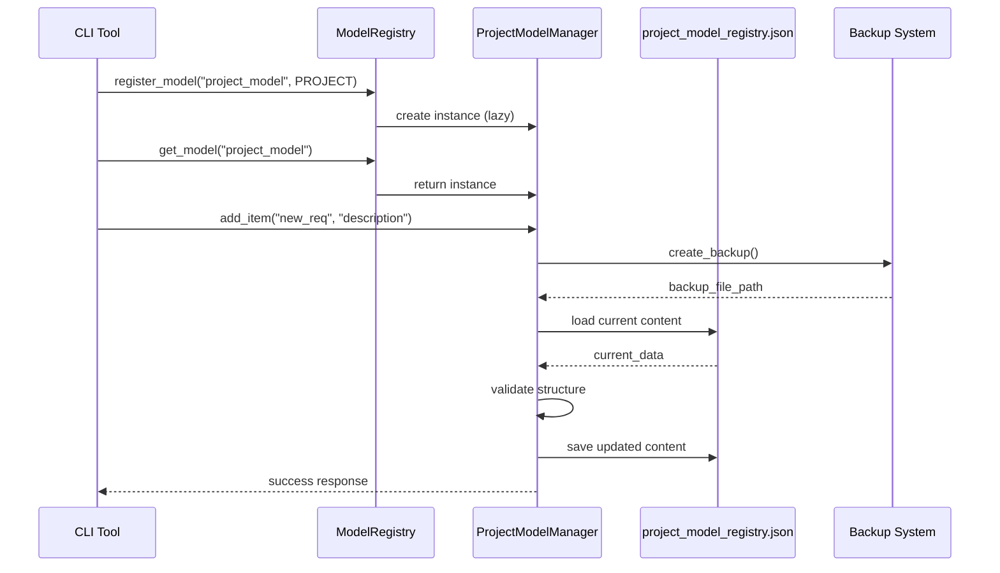

# Project Model Manager Integration Architecture

## 🎯 Overview

The **Project Model Manager** is a specialized Reflective Module that provides CRUD operations for `project_model_registry.json` while maintaining full RM compliance and integrating with the broader Model CRUD ecosystem.

## 🏗️ Architecture Diagram



## 🔗 Integration Points

### 1. Model Registry Integration

```python
# Registration
ModelRegistry.register_model(
    model_name="project_model",
    model_type=ModelType.PROJECT,
    model_file="project_model_registry.json",
    backup_dir="backups"
)

# Usage
project_manager = ModelRegistry.get_model("project_model")
project_manager.add_item("new_requirement", "Add voice control", collection="requirements_traceability")
```

### 2. CLI Integration

```bash
# Register project model
uv run python scripts/model_crud.py register-model \
    --model-name project_model \
    --model-type project \
    --model-file project_model_registry.json

# Use project model
uv run python scripts/model_crud.py add-item \
    --model-name project_model \
    --item-id voice_control \
    --description "Add voice control capabilities" \
    --collection requirements_traceability
```

### 3. Reflective Module Compliance

```python
# RM Interface Methods
await project_manager.get_module_capabilities()
project_manager.get_module_status()
project_manager.is_healthy()
project_manager.get_health_indicators()
```

## 📦 Dependencies

### Core Dependencies

| Dependency | Purpose | Version |
|------------|---------|---------|
| `json` | JSON parsing and serialization | Built-in |
| `pathlib` | File path operations | Built-in |
| `logging` | Logging and monitoring | Built-in |
| `time` | Timestamp generation | Built-in |
| `typing` | Type hints | Built-in |

### Internal Dependencies

| Module | Purpose | Import Path |
|--------|---------|-------------|
| `BaseReflectiveModule` | RM base functionality | `..generators.base_reflective_module` |
| `IModelCrud` | CRUD interface | `.interface` |

### Optional Dependencies

| Dependency | Purpose | When Used |
|------------|---------|-----------|
| `src.reflective_modules.health` | Module capability types | When available for enhanced RM compliance |

## 🔄 Data Flow



## 🛡️ Validation & Safety

### 1. Automatic Backup Creation

- **Before every operation**: Creates timestamped backup
- **Backup naming**: `project_model_registry_backup_{timestamp}.json`
- **Backup location**: `backups/` directory

### 2. Structure Validation

- **Required sections**: `domains`, `requirements_traceability`, `backlog`
- **JSON syntax**: Validates before saving
- **Schema compliance**: Checks against project model schema

### 3. Error Handling

- **RM compliance**: Tracks operation count and errors
- **Graceful degradation**: Continues operation on non-critical warnings
- **Detailed logging**: Comprehensive error reporting

## 🎯 Use Cases

### 1. Adding Backlog Items

```python
project_manager.add_item(
    item_id="voice_control_integration",
    description="Integrate Voice Mode MCP for enhanced developer productivity",
    priority="high",
    collection="backlog",
    domain="voice_mode",
    estimated_effort="2-3 weeks"
)
```

### 2. Adding Requirements

```python
project_manager.add_item(
    item_id="rm_compliance",
    description="All model managers must implement Reflective Module principles",
    collection="requirements_traceability",
    domain="reflective_modules",
    implementation="BaseReflectiveModule inheritance",
    test="test_rm_compliance.py"
)
```

### 3. Updating Domain Configuration

```python
project_manager.update_section("domains", {
    "model_crud": {
        "description": "Model CRUD operations with RM compliance",
        "patterns": ["**/*.json"],
        "content_indicators": ["model", "crud"],
        "linter": "model_crud_validator"
    }
})
```

## 🔧 Configuration

### Default Configuration

```python
ProjectModelManager(
    model_file="project_model_registry.json",
    backup_dir="backups"
)
```

### Custom Configuration

```python
ProjectModelManager(
    model_file="custom_model.json",
    backup_dir="model_backups"
)
```

## 📊 Monitoring & Metrics

### RM Compliance Metrics

- **Operation count**: Total successful operations
- **Error count**: Total failed operations
- **Last operation time**: Timestamp of last operation
- **Health status**: Overall module health

### Project Statistics

```python
stats = project_manager.get_project_stats()
# Returns:
# {
#     "total_domains": 45,
#     "total_requirements": 127,
#     "total_backlog_items": 23,
#     "pending_backlog_items": 15,
#     "high_priority_items": 8
# }
```

## 🚀 Benefits

### 1. **Abstraction**

- Hides implementation details (JSON vs Neo4j vs Ontology)
- Consistent interface across all model types
- Registry pattern for easy model management

### 2. **Safety**

- Automatic backups before every operation
- Validation of project model structure
- Error tracking and reporting

### 3. **RM Compliance**

- Full Reflective Module interface implementation
- Self-monitoring and health reporting
- Operational visibility

### 4. **Integration**

- Seamless CLI integration
- Registry-based model management
- Consistent with other model managers

## 🔮 Future Enhancements

### 1. **Schema Validation**

- Integration with `project_model_registry.schema.json`
- Real-time schema validation
- Schema evolution support

### 2. **Advanced Backup**

- Incremental backups
- Backup rotation and cleanup
- Backup verification

### 3. **Performance Optimization**

- Caching of frequently accessed data
- Batch operations
- Async operations for large models

### 4. **Enhanced Monitoring**

- Performance metrics
- Operation timing
- Resource usage tracking
