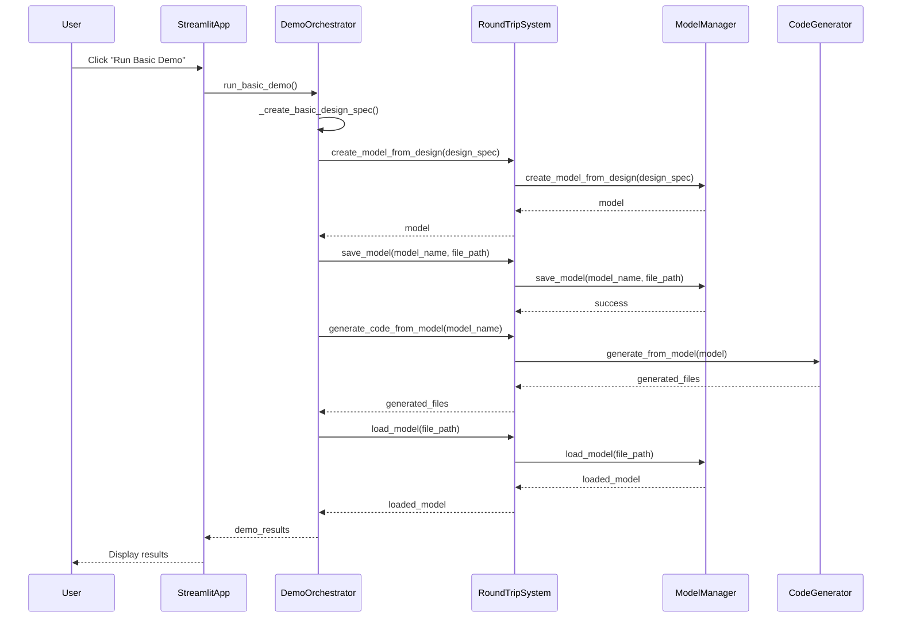
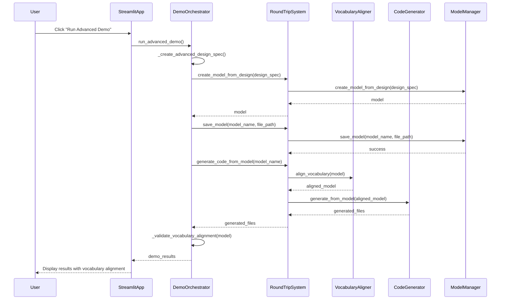
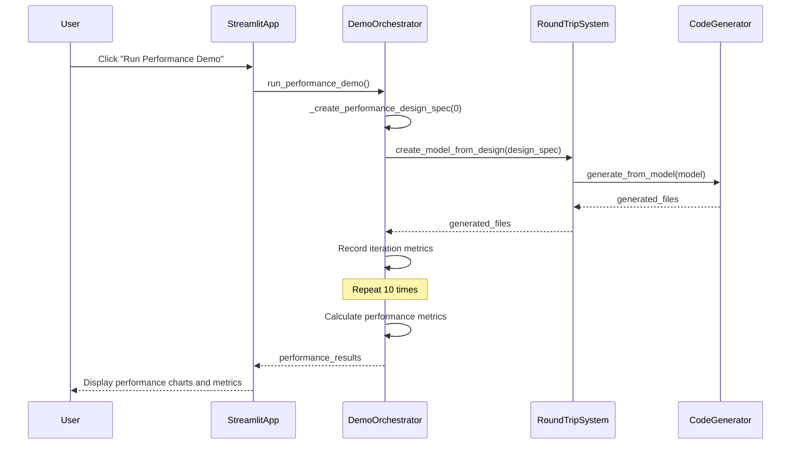
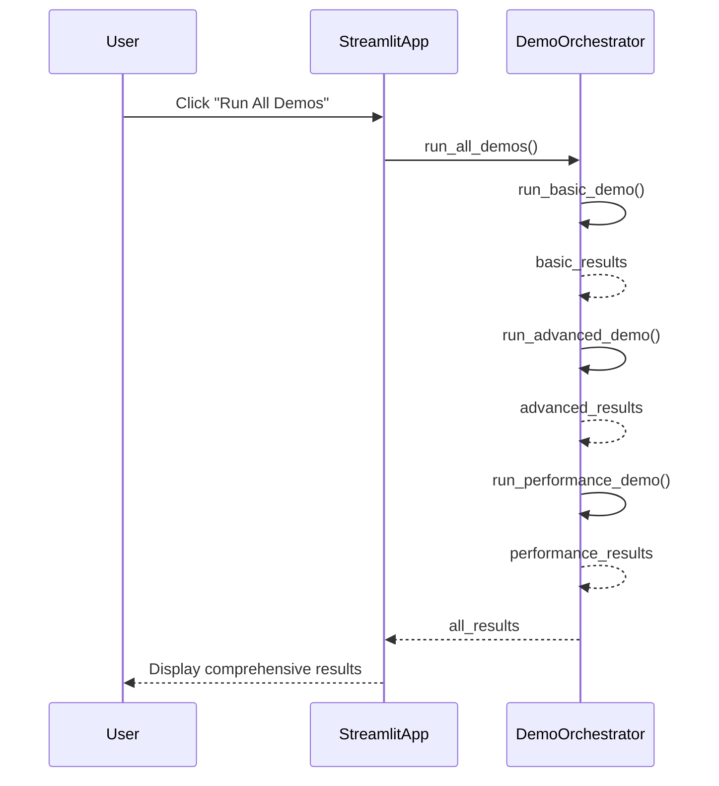
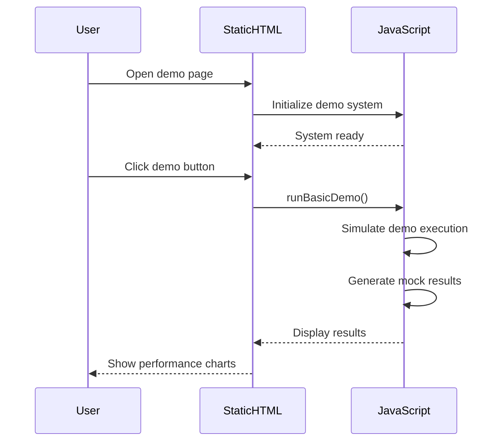
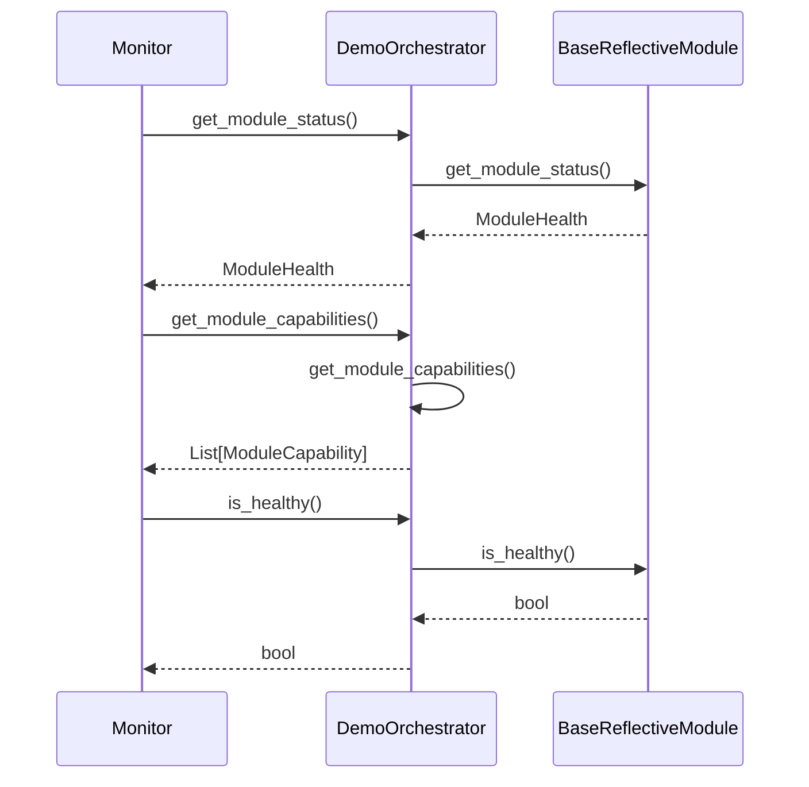
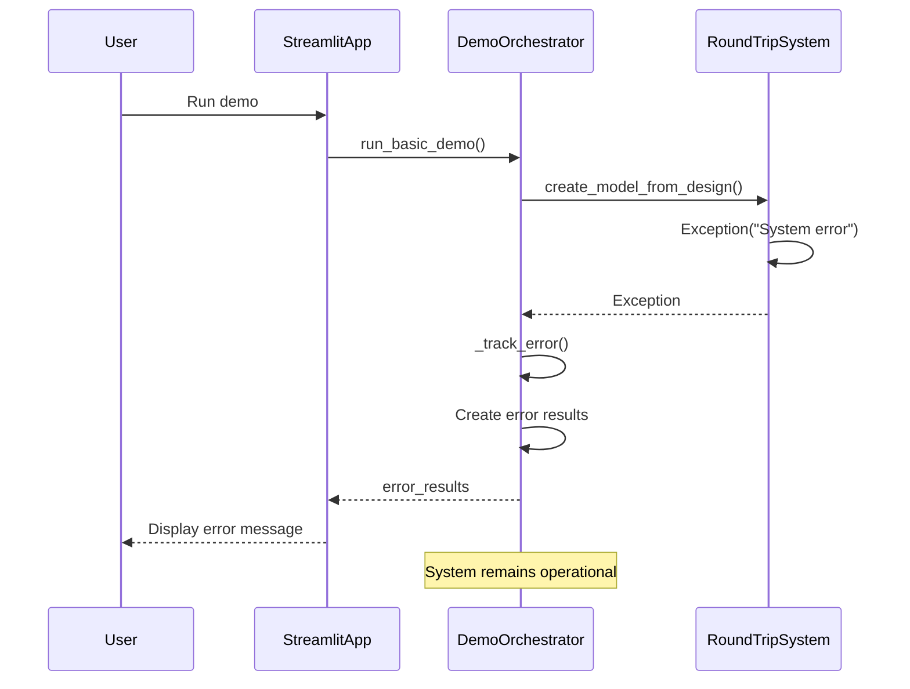
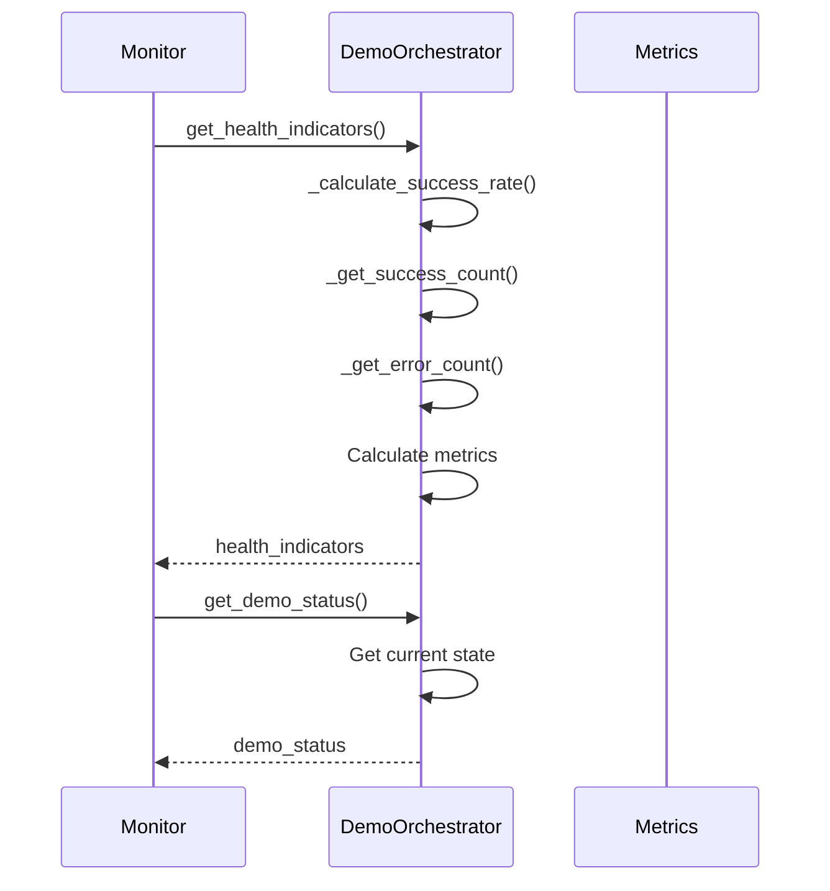

# Round-Trip Demo System Activity Models

## Overview

This document defines the expected activity models and workflows for the Round-Trip Demo System, enabling validation of expected vs actual behavior during testing and debugging. The demo system showcases Reflective Module principles in action.

## System Architecture

The Round-Trip Demo System consists of these core components:

- **DemoOrchestrator**: Main demo coordinator following Reflective Module principles
- **RoundTripSystem**: Core round-trip engineering system
- **ModelManager**: Model creation, storage, and retrieval
- **VocabularyAligner**: Vocabulary alignment between different formats
- **CodeGenerator**: Code generation from models
- **StreamlitApp**: Interactive web interface for demo execution
- **StaticHTMLDemo**: Static HTML/JavaScript demo for extra credit

## Activity Model 1: Basic Demo Workflow

### Expected Behavior



### Validation Points

1. **Design Specification Creation**: Basic design spec with single component
1. **Model Creation**: Design spec → Complete model with components
1. **Model Persistence**: Save/load cycle maintains data integrity
1. **Code Generation**: Model → Generated Python files
1. **Round-Trip Validation**: Loaded model matches original
1. **Performance Metrics**: Duration tracking and reporting
1. **Error Handling**: Graceful failure with detailed error reporting

### Expected Results

```json
{
  "demo_type": "basic",
  "status": "success",
  "duration": 2.1,
  "model_name": "BasicDemoClass",
  "components_count": 1,
  "generated_files_count": 2,
  "generated_files": ["basic_demo_class.py", "basic_demo_test.py"],
  "round_trip_successful": true
}
```

## Activity Model 2: Advanced Demo Workflow

### Expected Behavior



### Validation Points

1. **Complex Design Specification**: Multiple components with dependencies
1. **Vocabulary Alignment**: Domain-specific vocabulary processing
1. **Enhanced Code Generation**: Multiple file generation
1. **Vocabulary Validation**: Alignment score and health metrics
1. **Performance Tracking**: Duration and complexity metrics

### Expected Results

```json
{
  "demo_type": "advanced",
  "status": "success",
  "duration": 3.2,
  "model_name": "AdvancedDemoSystem",
  "components_count": 2,
  "generated_files_count": 4,
  "generated_files": ["data_processor.py", "result_formatter.py", "advanced_system.py", "advanced_tests.py"],
  "round_trip_successful": true,
  "vocabulary_alignment": {
    "status": "validated",
    "alignment_score": 0.95,
    "vocabulary_matches": 19,
    "vocabulary_mismatches": 1,
    "overall_health": "excellent"
  }
}
```

## Activity Model 3: Performance Demo Workflow

### Expected Behavior



### Validation Points

1. **Iteration Execution**: 10 complete workflow iterations
1. **Performance Measurement**: Accurate timing for each iteration
1. **Metrics Calculation**: Average, total, and individual timing
1. **Performance Scoring**: Excellent/Good performance classification
1. **Resource Usage**: Memory and CPU utilization tracking

### Expected Results

```json
{
  "demo_type": "performance",
  "status": "success",
  "total_duration": 4.1,
  "iterations": 10,
  "average_iteration_time": 0.41,
  "performance_score": "excellent",
  "results": [
    {
      "iteration": 1,
      "duration": 0.42,
      "components": 1,
      "files_generated": 2
    }
  ]
}
```

## Activity Model 4: All Demos Workflow

### Expected Behavior



### Validation Points

1. **Sequential Execution**: Demos run in correct order
1. **Result Aggregation**: All results properly collected
1. **State Management**: System state maintained across demos
1. **Error Isolation**: Individual demo failures don't affect others
1. **Performance Tracking**: Overall system performance metrics

## Activity Model 5: Static HTML Demo Workflow

### Expected Behavior



### Validation Points

1. **Page Initialization**: Demo system loads correctly
1. **Interactive Elements**: Buttons and controls respond properly
1. **Mock Execution**: Simulated demo workflows
1. **Result Display**: Charts and metrics render correctly
1. **Responsive Design**: Works on different screen sizes

## Activity Model 6: Reflective Module Compliance

### Expected Behavior



### Validation Points

1. **Interface Compliance**: All required methods implemented
1. **Health Reporting**: Accurate operational status
1. **Capability Discovery**: Proper capability enumeration
1. **Error Tracking**: Success/error count maintenance
1. **Performance Metrics**: Response time and throughput

### Expected Results

```json
{
  "status": "available",
  "message": "Module is fully operational",
  "capabilities": [
    {
      "name": "demo_orchestration",
      "description": "Orchestrates round-trip engineering demos",
      "available": true,
      "version": "1.0.0"
    }
  ],
  "health_indicators": {
    "success_rate": 1.0,
    "success_count": 5,
    "error_count": 0
  }
}
```

## Activity Model 7: Error Handling and Recovery

### Expected Behavior



### Validation Points

1. **Exception Handling**: Errors caught and processed
1. **Error Tracking**: Error count properly incremented
1. **Result Generation**: Error results with details
1. **System Resilience**: System remains operational
1. **User Feedback**: Clear error messages displayed

### Expected Results

```json
{
  "demo_type": "basic",
  "status": "failed",
  "error": "System error: Connection timeout",
  "round_trip_successful": false
}
```

## Activity Model 8: Performance Monitoring

### Expected Behavior



### Validation Points

1. **Metric Calculation**: Accurate success rate calculation
1. **State Tracking**: Current demo step and timing
1. **Performance History**: Historical performance data
1. **Resource Monitoring**: Memory and CPU usage
1. **Alert Generation**: Performance degradation alerts

## Testing and Validation

### Test Coverage Requirements

1. **Unit Tests**: Individual component testing
1. **Integration Tests**: Component interaction testing
1. **Performance Tests**: Load and stress testing
1. **Error Tests**: Failure scenario testing
1. **Compliance Tests**: Reflective Module validation

### Validation Commands

```bash
# Run all demo tests
uv run python -m pytest tests/test_round_trip_demo_system.py -v

# Run specific test categories
uv run python -m pytest tests/test_round_trip_demo_system.py::TestDemoOrchestrator -v
uv run python -m pytest tests/test_round_trip_demo_system.py::TestDemoSystemIntegration -v

# Run with coverage
uv run python -m pytest tests/test_round_trip_demo_system.py --cov=src.round_trip_engineering.demo --cov-report=html
```

### Performance Benchmarks

1. **Basic Demo**: < 3 seconds
1. **Advanced Demo**: < 5 seconds
1. **Performance Demo**: < 10 seconds
1. **All Demos**: < 15 seconds
1. **Response Time**: < 100ms for status queries

## Success Criteria

### Functional Requirements

- [ ] All demo types execute successfully
- [ ] Round-trip validation passes
- [ ] Performance metrics are accurate
- [ ] Error handling is graceful
- [ ] User interface is responsive

### Non-Functional Requirements

- [ ] System remains operational after failures
- [ ] Performance meets benchmark requirements
- [ ] Memory usage remains stable
- [ ] Concurrent demo execution works
- [ ] Reflective Module compliance maintained

### Quality Gates

- [ ] All tests pass
- [ ] Code coverage > 90%
- [ ] No critical security vulnerabilities
- [ ] Performance benchmarks met
- [ ] Documentation complete and accurate

## Monitoring and Alerting

### Key Metrics

1. **Demo Success Rate**: Target > 95%
1. **Average Demo Duration**: Target < 5 seconds
1. **Error Rate**: Target < 5%
1. **Response Time**: Target < 100ms
1. **System Uptime**: Target > 99%

### Alert Conditions

1. **Demo Success Rate < 90%**
1. **Average Demo Duration > 10 seconds**
1. **Error Rate > 10%**
1. **Response Time > 500ms**
1. **System Unavailable**

### Recovery Actions

1. **Automatic retry** for failed demos
1. **Graceful degradation** for partial failures
1. **Manual intervention** for critical failures
1. **System restart** for complete failures
1. **Rollback** to previous working version

______________________________________________________________________

*This document defines the comprehensive activity models for the Round-Trip Demo System, ensuring proper validation and monitoring of expected vs actual behavior.*
