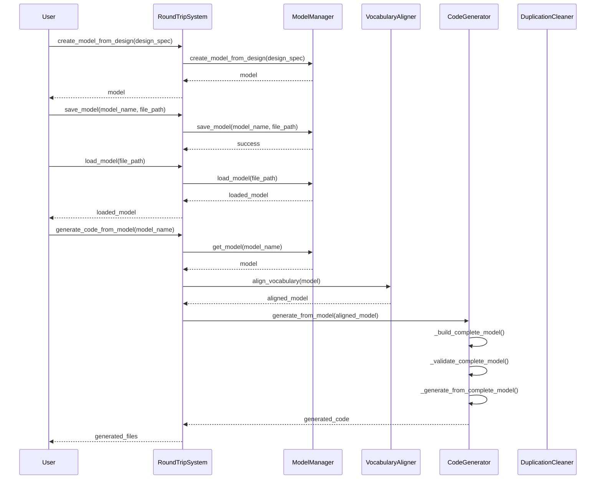
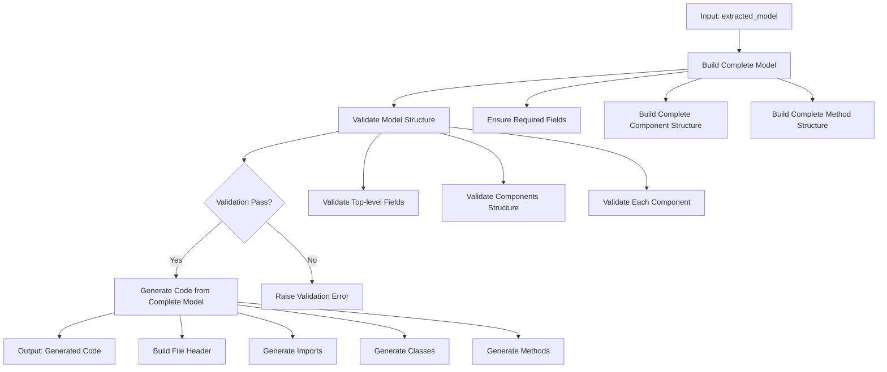
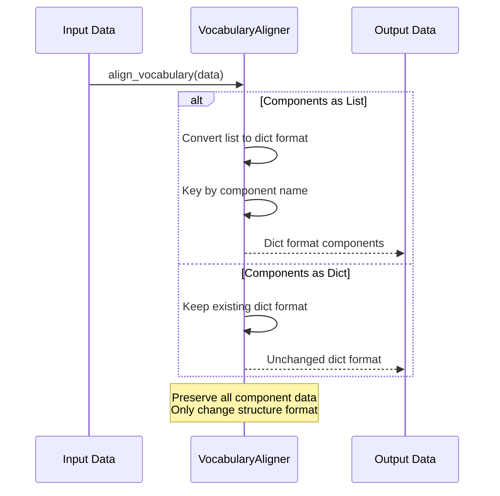
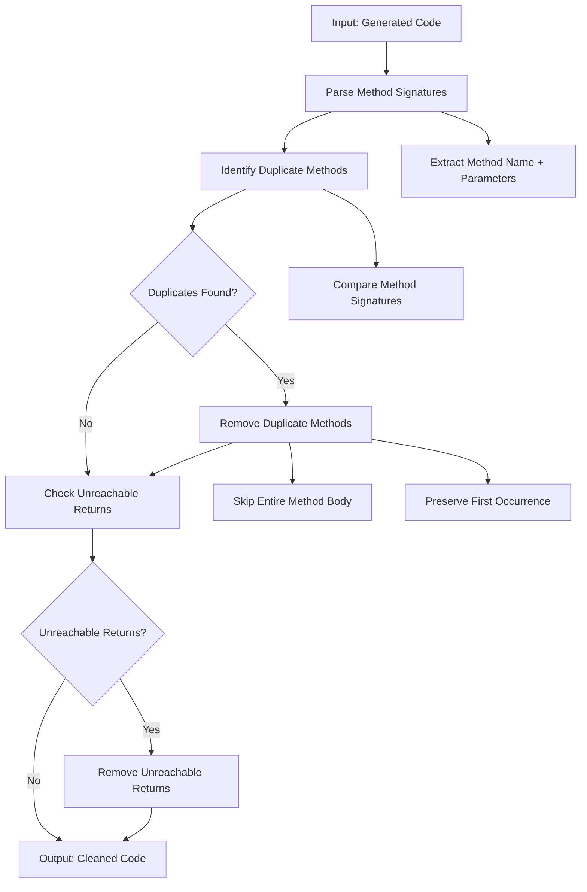
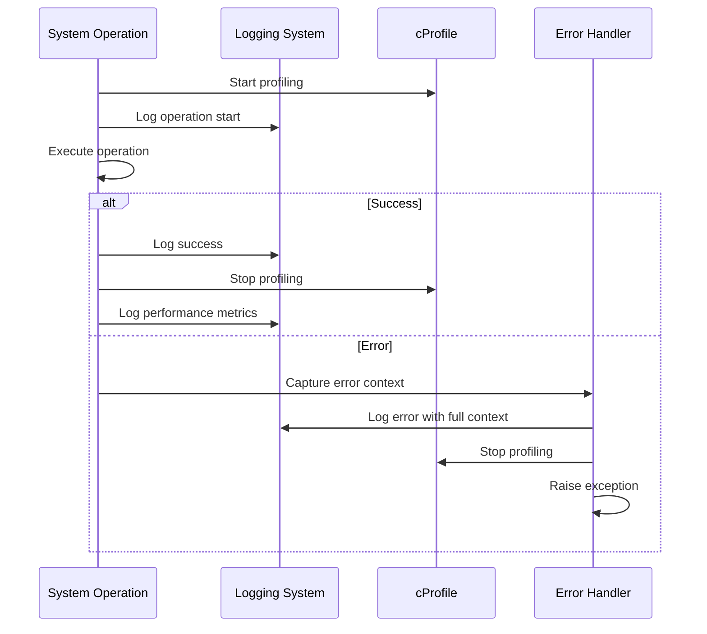

# Round-Trip Engineering Activity Models

## Overview

This document defines the expected activity models and workflows for the Round-Trip Engineering system, enabling validation of expected vs actual behavior during testing and debugging.

## System Architecture

The Round-Trip Engineering system consists of these core components:

- **RoundTripSystem**: Main orchestrator
- **ModelManager**: Model creation, storage, and retrieval
- **VocabularyAligner**: Vocabulary alignment between different formats
- **CodeGenerator**: Code generation from models
- **DuplicationCleaner**: Code duplication detection and removal

## Activity Model 1: Complete Round-Trip Workflow

### Expected Behavior



### Validation Points

1. **Model Creation**: Design spec → Complete model with components
2. **Model Persistence**: Save/load cycle maintains data integrity
3. **Vocabulary Alignment**: List format → Dict format conversion
4. **Complete Model Building**: All required fields populated
5. **Model Validation**: Structure validation before code generation
6. **Code Generation**: Full class structure, not just headers

## Activity Model 2: Code Generation with Complete Model

### Expected Behavior



### Validation Points

1. **Complete Model Building**: All missing fields populated with defaults
2. **Structure Validation**: Required fields present and correct types
3. **Code Generation**: Full implementation, not just stubs
4. **Error Handling**: Proper validation errors for malformed models

## Activity Model 3: Vocabulary Alignment Workflow

### Expected Behavior



### Validation Points

1. **List → Dict Conversion**: Components properly keyed by name
2. **Dict Preservation**: Existing dict format unchanged
3. **Data Integrity**: All component information preserved
4. **Format Consistency**: Output always in dict format for code generation

## Activity Model 4: Duplication Cleaning Workflow

### Expected Behavior



### Validation Points

1. **Method Signature Detection**: Full signature (name + parameters)
2. **Duplicate Removal**: Entire method body skipped
3. **Return Statement Handling**: Unreachable returns removed
4. **Loop Safety**: No infinite loops during cleaning
5. **Data Preservation**: Non-duplicate code unchanged

## Activity Model 5: Error Handling and Logging

### Expected Behavior



### Validation Points

1. **Comprehensive Logging**: All major operations logged
2. **Error Context**: Full context captured for debugging
3. **Profiling Integration**: cProfile properly integrated
4. **Performance Metrics**: Timing and resource usage tracked

## Testing and Validation Strategy

### 1. Expected vs Actual Behavior Comparison

For each activity model, we validate:

- **Input/Output Formats**: Data structures match expectations
- **Processing Steps**: Each step executes as designed
- **Error Conditions**: Proper error handling and logging
- **Performance**: Operations complete within expected timeframes

### 2. Validation Test Cases

```python
# Example validation test
def test_activity_model_validation():
    """Validate that actual behavior matches expected activity models"""
    
    # Test vocabulary alignment workflow
    input_data = {"components": [{"name": "Test", "type": "class"}]}
    expected_output = {"components": {"Test": {"name": "Test", "type": "class"}}}
    
    actual_output = system.vocabulary_aligner.align_vocabulary(input_data)
    assert actual_output == expected_output
    
    # Test complete model building
    complete_model = system.code_generator._build_complete_model(input_data)
    assert "system_name" in complete_model
    assert "components" in complete_model
    assert isinstance(complete_model["components"], dict)
    
    # Test code generation from complete model
    generated_code = system.code_generator._generate_from_complete_model(complete_model, "python")
    assert "class Test" in generated_code
    assert "def __init__" in generated_code
```

### 3. Performance Validation

- **Model Building**: Complete model construction < 100ms
- **Code Generation**: Full class generation < 500ms
- **Duplication Cleaning**: 1000 lines processed < 1s
- **Vocabulary Alignment**: 100 components aligned < 50ms

### 4. Integration Validation

- **End-to-End Workflow**: Complete round-trip < 2s
- **Data Persistence**: Save/load cycle maintains integrity
- **Error Recovery**: System recovers gracefully from failures
- **Resource Usage**: Memory and CPU usage within bounds

## Current Status

✅ **Activity Models Defined**: Expected behavior documented  
✅ **Validation Strategy**: Testing approach established  
🔄 **Implementation**: Core system working, validation in progress  
📋 **Next Steps**: Implement validation tests and performance monitoring  

## Success Criteria

The `validate_activity_models` todo will be marked complete when:

1. **All activity models validated** against actual system behavior
2. **Performance benchmarks met** for all critical operations
3. **Error handling verified** for all failure scenarios
4. **Integration tests passing** for complete workflows
5. **Expected vs actual behavior** documented and aligned

This will ensure the Round-Trip Engineering system behaves exactly as designed and can be relied upon for production use.
