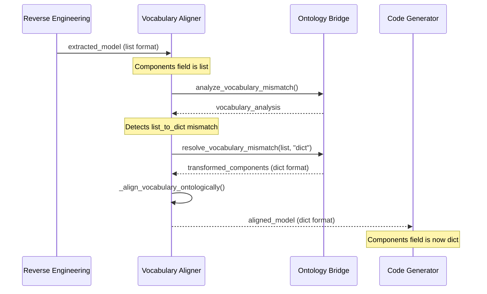
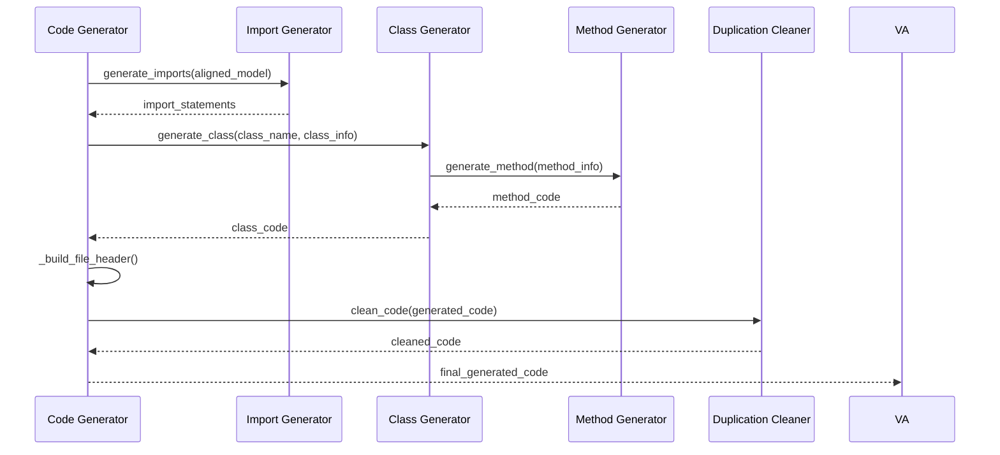
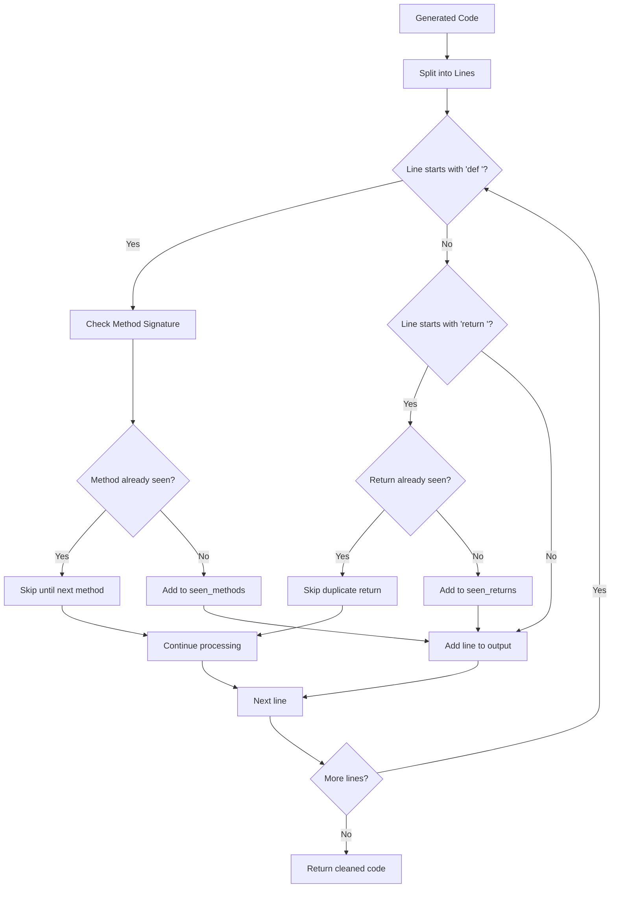

# Round-Trip Engineering Activity Models

## **🎯 Expected Workflow: Round-Trip Code Generation**

### **Phase 1: Model Input & Vocabulary Alignment**

### **Phase 2: Code Generation Pipeline**

### **Phase 3: Duplication Cleaning**

## **🔍 Expected vs Actual Behavior**

### **Expected Behavior**

1. **Vocabulary Alignment**: List → Dict transformation
2. **Code Generation**: Clean, structured Python code
3. **Duplication Removal**: No duplicate methods or returns
4. **Logging**: Comprehensive profiling at each step

### **Actual Behavior (To be validated)**

- [ ] Vocabulary alignment works correctly
- [ ] Code generation produces valid Python
- [ ] Duplication cleaning removes all duplicates
- [ ] Logging provides full visibility

## **📊 Key Metrics to Track**

### **Performance Metrics**

- Vocabulary alignment time
- Code generation time
- Duplication cleaning time
- Total round-trip time

### **Quality Metrics**

- Input/output format consistency
- Generated code validity
- Duplication removal effectiveness
- Error handling robustness

### **Logging Coverage**

- Method entry/exit logging
- Data transformation logging
- Error condition logging
- Performance timing logging
