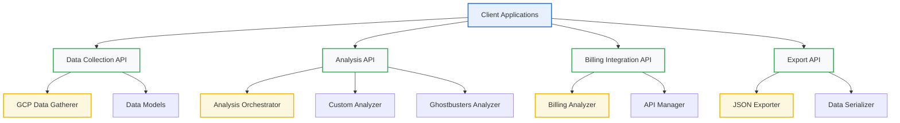

# GCP Data Collection & Analysis API Specifications

**Document:** GCP API Specifications\
**Version:** 1.0\
**Date:** 2024-12-19\
**Status:** Implementation Ready

______________________________________________________________________

## 📋 **Executive Summary**

This document defines the complete API specifications for the GCP Data Collection & Analysis System, including all interfaces, contracts, and implementation patterns.

______________________________________________________________________

## 🔌 **API Architecture**

### **API Layer Structure**



______________________________________________________________________

## 📊 **Data Collection API**

### **DC1: GCP Data Gatherer Interface**

#### **Class Definition**

```python
class GCPDataGatherer:
    """Pure data gathering layer for GCP billing and infrastructure data"""
    
    def __init__(self, project_id: Optional[str] = None):
        """Initialize the data gatherer
        
        Args:
            project_id: GCP project ID. If None, uses current project.
        
        Raises:
            RuntimeError: If project ID cannot be determined
        """
        pass
```

#### **Core Methods**

##### **gather_project_info()**

```python
def gather_project_info(self) -> GCPProjectInfo:
    """Gather comprehensive project information
    
    Returns:
        GCPProjectInfo: Complete project information
        
    Raises:
        RuntimeError: If project information cannot be retrieved
        subprocess.CalledProcessError: If gcloud command fails
    """
    pass
```

##### **gather_billing_account_info()**

```python
def gather_billing_account_info(self) -> Optional[BillingAccountInfo]:
    """Gather billing account information
    
    Returns:
        Optional[BillingAccountInfo]: Billing account information or None
        
    Raises:
        subprocess.CalledProcessError: If gcloud command fails
    """
    pass
```

##### **gather_service_usage()**

```python
def gather_service_usage(self) -> List[ServiceUsage]:
    """Gather service usage information
    
    Returns:
        List[ServiceUsage]: List of service usage information
        
    Raises:
        subprocess.CalledProcessError: If gcloud command fails
    """
    pass
```

##### **gather_resource_usage()**

```python
def gather_resource_usage(self) -> List[ResourceUsage]:
    """Gather resource usage information
    
    Returns:
        List[ResourceUsage]: List of resource usage information
        
    Raises:
        subprocess.CalledProcessError: If gcloud command fails
    """
    pass
```

##### **gather_cost_breakdown()**

```python
def gather_cost_breakdown(self) -> Dict[str, Any]:
    """Gather cost breakdown information
    
    Returns:
        Dict[str, Any]: Cost breakdown information
        
    Raises:
        subprocess.CalledProcessError: If gcloud command fails
    """
    pass
```

##### **gather_complete_billing_data()**

```python
def gather_complete_billing_data(self) -> BillingData:
    """Gather complete billing data from all sources
    
    Returns:
        BillingData: Complete billing data structure
        
    Raises:
        RuntimeError: If data collection fails
        subprocess.CalledProcessError: If gcloud command fails
    """
    pass
```

##### **export_billing_data()**

```python
def export_billing_data(self, billing_data: BillingData, output_path: str) -> None:
    """Export billing data to JSON file
    
    Args:
        billing_data: Billing data to export
        output_path: Path to output JSON file
        
    Raises:
        IOError: If file cannot be written
        ValueError: If data cannot be serialized
    """
    pass
```

### **DC2: Factory Functions**

#### **create_data_gatherer()**

```python
def create_data_gatherer(project_id: Optional[str] = None) -> GCPDataGatherer:
    """Factory function to create GCP data gatherer
    
    Args:
        project_id: GCP project ID. If None, uses current project.
        
    Returns:
        GCPDataGatherer: Configured data gatherer instance
    """
    pass
```

______________________________________________________________________

## 🔍 **Analysis API**

### **A1: Analysis Engine Interface**

#### **Abstract Base Class**

```python
class AnalysisEngine(ABC):
    """Abstract base class for analysis engines"""
    
    @abstractmethod
    def analyze(self, billing_data: BillingData) -> AnalysisResult:
        """Analyze billing data and return results
        
        Args:
            billing_data: Billing data to analyze
            
        Returns:
            AnalysisResult: Analysis results
            
        Raises:
            AnalysisError: If analysis fails
        """
        pass
    
    @abstractmethod
    def get_engine_name(self) -> str:
        """Get the name of this analysis engine
        
        Returns:
            str: Engine name
        """
        pass
```

### **A2: Custom Billing Analysis Engine**

#### **Class Definition**

```python
class CustomBillingAnalysisEngine(AnalysisEngine):
    """Custom billing analysis engine"""
    
    def __init__(self):
        """Initialize custom billing analysis engine"""
        pass
```

#### **Methods**

##### **analyze()**

```python
def analyze(self, billing_data: BillingData) -> BillingAnalysisResult:
    """Analyze billing data using custom logic
    
    Args:
        billing_data: Billing data to analyze
        
    Returns:
        BillingAnalysisResult: Specialized billing analysis results
        
    Raises:
        AnalysisError: If analysis fails
    """
    pass
```

##### **get_engine_name()**

```python
def get_engine_name(self) -> str:
    """Get the name of this analysis engine
    
    Returns:
        str: "Custom Billing Analyzer"
    """
    pass
```

### **A3: Ghostbusters Analysis Engine**

#### **Class Definition**

```python
class GhostbustersAnalysisEngine(AnalysisEngine):
    """Ghostbusters-based analysis engine"""
    
    def __init__(self, project_path: str = "."):
        """Initialize Ghostbusters analysis engine
        
        Args:
            project_path: Path to project for Ghostbusters analysis
        """
        pass
```

#### **Methods**

##### **analyze()**

```python
def analyze(self, billing_data: BillingData) -> AnalysisResult:
    """Analyze billing data using Ghostbusters
    
    Args:
        billing_data: Billing data to analyze
        
    Returns:
        AnalysisResult: Ghostbusters analysis results
        
    Raises:
        AnalysisError: If analysis fails
    """
    pass
```

##### **get_engine_name()**

```python
def get_engine_name(self) -> str:
    """Get the name of this analysis engine
    
    Returns:
        str: "Ghostbusters"
    """
    pass
```

### **A4: Analysis Orchestrator**

#### **Class Definition**

```python
class AnalysisOrchestrator:
    """Orchestrator for running multiple analysis engines"""
    
    def __init__(self, project_path: str = "."):
        """Initialize the analysis orchestrator
        
        Args:
            project_path: Path to project for analysis
        """
        pass
```

#### **Methods**

##### **run_analysis()**

```python
def run_analysis(self, billing_data: BillingData, engine_names: Optional[List[str]] = None) -> Dict[str, AnalysisResult]:
    """Run analysis using specified engines
    
    Args:
        billing_data: Billing data to analyze
        engine_names: List of engine names to use. If None, uses all available.
        
    Returns:
        Dict[str, AnalysisResult]: Results from each analysis engine
        
    Raises:
        AnalysisError: If analysis fails
    """
    pass
```

##### **get_available_engines()**

```python
def get_available_engines(self) -> List[str]:
    """Get list of available analysis engines
    
    Returns:
        List[str]: List of available engine names
    """
    pass
```

##### **export_analysis_results()**

```python
def export_analysis_results(self, results: Dict[str, AnalysisResult], output_path: str) -> None:
    """Export analysis results to JSON file
    
    Args:
        results: Analysis results to export
        output_path: Path to output JSON file
        
    Raises:
        IOError: If file cannot be written
        ValueError: If data cannot be serialized
    """
    pass
```

### **A5: Factory Functions**

#### **create_analysis_orchestrator()**

```python
def create_analysis_orchestrator(project_path: str = ".") -> AnalysisOrchestrator:
    """Factory function to create analysis orchestrator
    
    Args:
        project_path: Path to project for analysis
        
    Returns:
        AnalysisOrchestrator: Configured orchestrator instance
    """
    pass
```

______________________________________________________________________

## 💰 **Billing Integration API**

### **B1: Billing Analyzer with API Management**

#### **Class Definition**

```python
class BillingAnalyzerWithAPIManagement:
    """Enhanced billing analyzer with API management capabilities"""
    
    def __init__(self, project_id: Optional[str] = None, enterprise_scenario: str = "admin_credentials"):
        """Initialize the enhanced billing analyzer
        
        Args:
            project_id: GCP project ID. If None, uses current project.
            enterprise_scenario: Enterprise scenario for API management
        """
        pass
```

#### **Methods**

##### **validate_prerequisites()**

```python
def validate_prerequisites(self) -> Dict[str, Any]:
    """Validate all prerequisites for billing analysis
    
    Returns:
        Dict[str, Any]: Prerequisites validation results
        
    Raises:
        ValidationError: If validation fails
    """
    pass
```

##### **enable_required_apis()**

```python
def enable_required_apis(self, force: bool = False) -> Dict[str, Any]:
    """Enable all required APIs for billing analysis
    
    Args:
        force: Force enable APIs even if already enabled
        
    Returns:
        Dict[str, Any]: API enablement results
        
    Raises:
        APIError: If API enablement fails
    """
    pass
```

##### **run_billing_analysis_with_validation()**

```python
def run_billing_analysis_with_validation(self) -> Dict[str, Any]:
    """Run billing analysis with full validation and API management
    
    Returns:
        Dict[str, Any]: Complete billing analysis results
        
    Raises:
        AnalysisError: If analysis fails
        ValidationError: If validation fails
    """
    pass
```

##### **generate_enterprise_workflow_report()**

```python
def generate_enterprise_workflow_report(self) -> Dict[str, Any]:
    """Generate comprehensive enterprise workflow report
    
    Returns:
        Dict[str, Any]: Enterprise workflow report
        
    Raises:
        ReportError: If report generation fails
    """
    pass
```

### **B2: Factory Functions**

#### **create_enhanced_billing_analyzer()**

```python
def create_enhanced_billing_analyzer(project_id: Optional[str] = None, enterprise_scenario: str = "admin_credentials") -> BillingAnalyzerWithAPIManagement:
    """Factory function to create enhanced billing analyzer
    
    Args:
        project_id: GCP project ID. If None, uses current project.
        enterprise_scenario: Enterprise scenario for API management
        
    Returns:
        BillingAnalyzerWithAPIManagement: Configured analyzer instance
    """
    pass
```

______________________________________________________________________

## 📤 **Export API**

### **E1: Data Serialization**

#### **Billing Data Serialization**

```python
def serialize_billing_data(billing_data: BillingData) -> Dict[str, Any]:
    """Serialize BillingData to dictionary for JSON export
    
    Args:
        billing_data: Billing data to serialize
        
    Returns:
        Dict[str, Any]: Serialized billing data
        
    Raises:
        SerializationError: If serialization fails
    """
    pass
```

#### **Analysis Result Serialization**

```python
def serialize_analysis_result(result: AnalysisResult) -> Dict[str, Any]:
    """Serialize AnalysisResult to dictionary for JSON export
    
    Args:
        result: Analysis result to serialize
        
    Returns:
        Dict[str, Any]: Serialized analysis result
        
    Raises:
        SerializationError: If serialization fails
    """
    pass
```

### **E2: JSON Export**

#### **Export Billing Data**

```python
def export_billing_data_to_json(billing_data: BillingData, output_path: str) -> None:
    """Export billing data to JSON file
    
    Args:
        billing_data: Billing data to export
        output_path: Path to output JSON file
        
    Raises:
        IOError: If file cannot be written
        SerializationError: If data cannot be serialized
    """
    pass
```

#### **Export Analysis Results**

```python
def export_analysis_results_to_json(results: Dict[str, AnalysisResult], output_path: str) -> None:
    """Export analysis results to JSON file
    
    Args:
        results: Analysis results to export
        output_path: Path to output JSON file
        
    Raises:
        IOError: If file cannot be written
        SerializationError: If data cannot be serialized
    """
    pass
```

______________________________________________________________________

## 🔧 **Error Handling**

### **EH1: Custom Exceptions**

#### **AnalysisError**

```python
class AnalysisError(Exception):
    """Base exception for analysis errors"""
    
    def __init__(self, message: str, analysis_id: Optional[str] = None):
        super().__init__(message)
        self.analysis_id = analysis_id
```

#### **ValidationError**

```python
class ValidationError(Exception):
    """Exception for validation errors"""
    
    def __init__(self, message: str, field: Optional[str] = None):
        super().__init__(message)
        self.field = field
```

#### **APIError**

```python
class APIError(Exception):
    """Exception for API errors"""
    
    def __init__(self, message: str, api_name: Optional[str] = None):
        super().__init__(message)
        self.api_name = api_name
```

#### **SerializationError**

```python
class SerializationError(Exception):
    """Exception for serialization errors"""
    
    def __init__(self, message: str, data_type: Optional[str] = None):
        super().__init__(message)
        self.data_type = data_type
```

### **EH2: Error Handling Patterns**

#### **Graceful Degradation**

```python
def safe_analyze(self, billing_data: BillingData) -> AnalysisResult:
    """Safely analyze billing data with error handling"""
    try:
        return self.analyze(billing_data)
    except Exception as e:
        logger.error(f"Analysis failed: {e}")
        return AnalysisResult(
            analysis_id=f"error_{datetime.now().isoformat()}",
            analysis_type="error",
            analyzer_name=self.get_engine_name(),
            confidence_score=0.0,
            findings=[{"type": "error", "message": str(e)}],
            recommendations=[{"action": "check_config", "priority": "high"}]
        )
```

#### **Retry Logic**

```python
def retry_api_call(self, func, max_retries: int = 3, delay: float = 1.0):
    """Retry API call with exponential backoff"""
    for attempt in range(max_retries):
        try:
            return func()
        except subprocess.CalledProcessError as e:
            if attempt == max_retries - 1:
                raise
            time.sleep(delay * (2 ** attempt))
```

______________________________________________________________________

## 📊 **API Usage Examples**

### **U1: Data Collection Example**

```python
# Create data gatherer
gatherer = create_data_gatherer("my-project-id")

# Gather complete billing data
billing_data = gatherer.gather_complete_billing_data()

# Export data
gatherer.export_billing_data(billing_data, "data/billing_data.json")
```

### **U2: Analysis Example**

```python
# Create analysis orchestrator
orchestrator = create_analysis_orchestrator(".")

# Run analysis
results = orchestrator.run_analysis(billing_data)

# Export results
orchestrator.export_analysis_results(results, "data/analysis_results.json")
```

### **U3: Billing Integration Example**

```python
# Create enhanced billing analyzer
analyzer = create_enhanced_billing_analyzer("my-project-id", "admin_credentials")

# Validate prerequisites
validation = analyzer.validate_prerequisites()

# Run analysis with validation
results = analyzer.run_billing_analysis_with_validation()
```

### **U4: Complete Workflow Example**

```python
# Complete GCP data collection and analysis workflow
def complete_workflow(project_id: str, output_dir: str):
    """Complete workflow for GCP data collection and analysis"""
    
    # Step 1: Data Collection
    gatherer = create_data_gatherer(project_id)
    billing_data = gatherer.gather_complete_billing_data()
    gatherer.export_billing_data(billing_data, f"{output_dir}/billing_data.json")
    
    # Step 2: Analysis
    orchestrator = create_analysis_orchestrator(".")
    results = orchestrator.run_analysis(billing_data)
    orchestrator.export_analysis_results(results, f"{output_dir}/analysis_results.json")
    
    # Step 3: Billing Integration
    analyzer = create_enhanced_billing_analyzer(project_id)
    billing_analysis = analyzer.run_billing_analysis_with_validation()
    
    return {
        "billing_data": billing_data,
        "analysis_results": results,
        "billing_analysis": billing_analysis
    }
```

______________________________________________________________________

## 📋 **API Summary**

### **Core APIs**

- **GCPDataGatherer**: Pure data collection from GCP APIs
- **AnalysisOrchestrator**: Multi-engine analysis orchestration
- **BillingAnalyzerWithAPIManagement**: Enterprise billing analysis
- **Export Functions**: JSON data and results export

### **Key Features**

- **Type Safety**: Strong typing with dataclasses
- **Error Handling**: Comprehensive error handling and recovery
- **Factory Functions**: Easy instantiation of components
- **Extensibility**: Plugin architecture for analysis engines
- **Serialization**: Complete data serialization support

### **Usage Patterns**

- **Data Collection**: Gather all GCP data in one call
- **Analysis**: Run multiple analysis engines
- **Billing Integration**: Enterprise-ready billing analysis
- **Export**: JSON export for all data and results

______________________________________________________________________

**This API specification provides the complete interface definition for implementing the GCP Data Collection & Analysis System with Beast Mode principles!** 🚀
