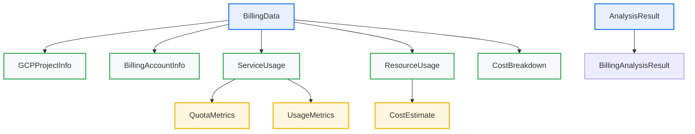

# GCP Data Collection & Analysis Data Models

**Document:** GCP Data Models\
**Version:** 1.0\
**Date:** 2024-12-19\
**Status:** Implementation Ready

______________________________________________________________________

## 📋 **Executive Summary**

This document defines the complete data models for the GCP Data Collection & Analysis System, including all structured data classes, schemas, and validation rules.

______________________________________________________________________

## 🏗️ **Data Model Architecture**

### **Model Hierarchy**



______________________________________________________________________

## 📊 **Core Data Models**

### **DM1: GCP Project Information**

#### **GCPProjectInfo**

```python
@dataclass
class GCPProjectInfo:
    """GCP Project information"""
    project_id: str
    project_name: str
    project_number: str
    billing_account_id: Optional[str] = None
    billing_enabled: bool = False
    labels: Dict[str, str] = field(default_factory=dict)
    created_at: Optional[datetime] = None
    updated_at: Optional[datetime] = None
    lifecycle_state: str = "ACTIVE"
    parent: Optional[Dict[str, str]] = None
```

#### **Field Descriptions**

- **project_id**: Unique GCP project identifier
- **project_name**: Human-readable project name
- **project_number**: Numeric project identifier
- **billing_account_id**: Associated billing account ID
- **billing_enabled**: Whether billing is enabled
- **labels**: Project labels and metadata
- **created_at**: Project creation timestamp
- **updated_at**: Last update timestamp
- **lifecycle_state**: Project lifecycle state
- **parent**: Parent organization or folder

### **DM2: Billing Account Information**

#### **BillingAccountInfo**

```python
@dataclass
class BillingAccountInfo:
    """Billing account information"""
    account_id: str
    display_name: str
    open: bool
    currency_code: str
    master_billing_account: Optional[str] = None
    parent: Optional[str] = None
    billing_enabled: bool = True
    created_at: Optional[datetime] = None
    updated_at: Optional[datetime] = None
```

#### **Field Descriptions**

- **account_id**: Unique billing account identifier
- **display_name**: Human-readable account name
- **open**: Whether account is open for billing
- **currency_code**: Billing currency (e.g., "USD")
- **master_billing_account**: Master billing account ID
- **parent**: Parent organization
- **billing_enabled**: Whether billing is enabled
- **created_at**: Account creation timestamp
- **updated_at**: Last update timestamp

### **DM3: Service Usage Information**

#### **ServiceUsage**

```python
@dataclass
class ServiceUsage:
    """Service usage information"""
    service_name: str
    enabled: bool
    quota_metrics: List[Dict[str, Any]] = field(default_factory=list)
    usage_metrics: List[Dict[str, Any]] = field(default_factory=list)
    config: Dict[str, Any] = field(default_factory=dict)
    last_used: Optional[datetime] = None
    usage_count: int = 0
    cost_estimate: Optional[float] = None
```

#### **Field Descriptions**

- **service_name**: GCP service name (e.g., "compute.googleapis.com")
- **enabled**: Whether service is enabled
- **quota_metrics**: Service quota information
- **usage_metrics**: Service usage statistics
- **config**: Service-specific configuration
- **last_used**: Last usage timestamp
- **usage_count**: Total usage count
- **cost_estimate**: Estimated cost for service

#### **QuotaMetrics**

```python
@dataclass
class QuotaMetrics:
    """Service quota metrics"""
    metric_name: str
    limit: float
    usage: float
    unit: str
    quota_type: str
    region: Optional[str] = None
    effective_limit: Optional[float] = None
```

#### **UsageMetrics**

```python
@dataclass
class UsageMetrics:
    """Service usage metrics"""
    metric_name: str
    value: float
    unit: str
    timestamp: datetime
    region: Optional[str] = None
    resource_type: Optional[str] = None
```

### **DM4: Resource Usage Information**

#### **ResourceUsage**

```python
@dataclass
class ResourceUsage:
    """Resource usage information"""
    resource_type: str
    resource_name: str
    location: str
    usage_amount: float
    usage_unit: str
    timestamp: datetime
    cost_estimate: Optional[float] = None
    status: str = "ACTIVE"
    labels: Dict[str, str] = field(default_factory=dict)
    metadata: Dict[str, Any] = field(default_factory=dict)
```

#### **Field Descriptions**

- **resource_type**: Type of resource (e.g., "cloud_function", "cloud_run")
- **resource_name**: Resource name
- **location**: Resource location/region
- **usage_amount**: Usage amount
- **usage_unit**: Unit of measurement
- **timestamp**: Usage timestamp
- **cost_estimate**: Estimated cost
- **status**: Resource status
- **labels**: Resource labels
- **metadata**: Additional resource metadata

### **DM5: Cost Breakdown Information**

#### **CostBreakdown**

```python
@dataclass
class CostBreakdown:
    """Cost breakdown information"""
    total_cost: float
    cost_by_service: Dict[str, float] = field(default_factory=dict)
    cost_by_region: Dict[str, float] = field(default_factory=dict)
    cost_by_resource: Dict[str, float] = field(default_factory=dict)
    cost_trends: List[Dict[str, Any]] = field(default_factory=list)
    budget_alerts: List[Dict[str, Any]] = field(default_factory=list)
    cost_anomalies: List[Dict[str, Any]] = field(default_factory=list)
    billing_export_available: bool = False
    export_destinations: List[Dict[str, Any]] = field(default_factory=list)
    budgets: List[Dict[str, Any]] = field(default_factory=list)
    currency: str = "USD"
    period_start: Optional[datetime] = None
    period_end: Optional[datetime] = None
```

#### **Field Descriptions**

- **total_cost**: Total cost for the period
- **cost_by_service**: Cost breakdown by service
- **cost_by_region**: Cost breakdown by region
- **cost_by_resource**: Cost breakdown by resource type
- **cost_trends**: Historical cost trends
- **budget_alerts**: Budget alert information
- **cost_anomalies**: Unusual cost patterns
- **billing_export_available**: Whether billing export is configured
- **export_destinations**: Billing export destinations
- **budgets**: Budget configuration
- **currency**: Cost currency
- **period_start**: Cost period start
- **period_end**: Cost period end

### **DM6: Complete Billing Data**

#### **BillingData**

```python
@dataclass
class BillingData:
    """Complete billing data structure"""
    project_info: GCPProjectInfo
    billing_account: Optional[BillingAccountInfo]
    service_usage: List[ServiceUsage]
    resource_usage: List[ResourceUsage]
    cost_breakdown: CostBreakdown
    timestamp: datetime
    data_source: str = "gcp_apis"
    collection_duration: Optional[float] = None
    errors: List[Dict[str, Any]] = field(default_factory=list)
    warnings: List[Dict[str, Any]] = field(default_factory=list)
```

#### **Field Descriptions**

- **project_info**: GCP project information
- **billing_account**: Billing account information
- **service_usage**: List of service usage data
- **resource_usage**: List of resource usage data
- **cost_breakdown**: Cost breakdown information
- **timestamp**: Data collection timestamp
- **data_source**: Source of the data
- **collection_duration**: Time taken to collect data
- **errors**: Collection errors
- **warnings**: Collection warnings

______________________________________________________________________

## 🔍 **Analysis Data Models**

### **AM1: Analysis Result**

#### **AnalysisResult**

```python
@dataclass
class AnalysisResult:
    """Result of an analysis operation"""
    analysis_id: str
    analysis_type: str
    analyzer_name: str
    confidence_score: float
    findings: List[Dict[str, Any]]
    recommendations: List[Dict[str, Any]]
    metadata: Dict[str, Any] = field(default_factory=dict)
    timestamp: datetime = field(default_factory=datetime.now)
    execution_time: Optional[float] = None
    status: str = "completed"
    errors: List[Dict[str, Any]] = field(default_factory=list)
```

#### **Field Descriptions**

- **analysis_id**: Unique analysis identifier
- **analysis_type**: Type of analysis performed
- **analyzer_name**: Name of the analysis engine
- **confidence_score**: Analysis confidence (0.0-1.0)
- **findings**: Analysis findings
- **recommendations**: Analysis recommendations
- **metadata**: Additional analysis metadata
- **timestamp**: Analysis timestamp
- **execution_time**: Analysis execution time
- **status**: Analysis status
- **errors**: Analysis errors

### **AM2: Billing Analysis Result**

#### **BillingAnalysisResult**

```python
@dataclass
class BillingAnalysisResult(AnalysisResult):
    """Specialized result for billing analysis"""
    cost_optimization_score: float
    cost_anomalies: List[Dict[str, Any]]
    budget_alerts: List[Dict[str, Any]]
    resource_efficiency: Dict[str, Any]
    unused_resources: List[Dict[str, Any]] = field(default_factory=list)
    cost_savings_potential: float = 0.0
    optimization_opportunities: List[Dict[str, Any]] = field(default_factory=list)
```

#### **Field Descriptions**

- **cost_optimization_score**: Cost optimization score (0-100)
- **cost_anomalies**: Detected cost anomalies
- **budget_alerts**: Budget alert information
- **resource_efficiency**: Resource efficiency metrics
- **unused_resources**: List of unused resources
- **cost_savings_potential**: Potential cost savings
- **optimization_opportunities**: Optimization opportunities

### **AM3: Finding and Recommendation Models**

#### **Finding**

```python
@dataclass
class Finding:
    """Analysis finding"""
    finding_id: str
    type: str
    category: str
    severity: str
    description: str
    affected_resource: Optional[str] = None
    impact: Optional[str] = None
    confidence: float = 1.0
    metadata: Dict[str, Any] = field(default_factory=dict)
```

#### **Recommendation**

```python
@dataclass
class Recommendation:
    """Analysis recommendation"""
    recommendation_id: str
    action: str
    priority: str
    description: str
    affected_resource: Optional[str] = None
    estimated_impact: Optional[str] = None
    implementation_effort: str = "medium"
    metadata: Dict[str, Any] = field(default_factory=dict)
```

______________________________________________________________________

## 🔧 **Validation Rules**

### **V1: Data Validation**

#### **GCPProjectInfo Validation**

```python
def validate_gcp_project_info(project_info: GCPProjectInfo) -> List[str]:
    """Validate GCP project information"""
    errors = []
    
    if not project_info.project_id:
        errors.append("Project ID is required")
    
    if not project_info.project_name:
        errors.append("Project name is required")
    
    if not project_info.project_number:
        errors.append("Project number is required")
    
    if project_info.billing_enabled and not project_info.billing_account_id:
        errors.append("Billing account ID required when billing is enabled")
    
    return errors
```

#### **BillingAccountInfo Validation**

```python
def validate_billing_account_info(billing_account: BillingAccountInfo) -> List[str]:
    """Validate billing account information"""
    errors = []
    
    if not billing_account.account_id:
        errors.append("Account ID is required")
    
    if not billing_account.display_name:
        errors.append("Display name is required")
    
    if not billing_account.currency_code:
        errors.append("Currency code is required")
    
    if billing_account.currency_code not in ["USD", "EUR", "GBP", "JPY"]:
        errors.append("Unsupported currency code")
    
    return errors
```

#### **ServiceUsage Validation**

```python
def validate_service_usage(service_usage: ServiceUsage) -> List[str]:
    """Validate service usage information"""
    errors = []
    
    if not service_usage.service_name:
        errors.append("Service name is required")
    
    if not service_usage.service_name.endswith(".googleapis.com"):
        errors.append("Invalid service name format")
    
    if service_usage.usage_count < 0:
        errors.append("Usage count cannot be negative")
    
    if service_usage.cost_estimate is not None and service_usage.cost_estimate < 0:
        errors.append("Cost estimate cannot be negative")
    
    return errors
```

#### **ResourceUsage Validation**

```python
def validate_resource_usage(resource_usage: ResourceUsage) -> List[str]:
    """Validate resource usage information"""
    errors = []
    
    if not resource_usage.resource_type:
        errors.append("Resource type is required")
    
    if not resource_usage.resource_name:
        errors.append("Resource name is required")
    
    if not resource_usage.location:
        errors.append("Location is required")
    
    if resource_usage.usage_amount < 0:
        errors.append("Usage amount cannot be negative")
    
    if resource_usage.cost_estimate is not None and resource_usage.cost_estimate < 0:
        errors.append("Cost estimate cannot be negative")
    
    return errors
```

### **V2: Analysis Validation**

#### **AnalysisResult Validation**

```python
def validate_analysis_result(result: AnalysisResult) -> List[str]:
    """Validate analysis result"""
    errors = []
    
    if not result.analysis_id:
        errors.append("Analysis ID is required")
    
    if not result.analysis_type:
        errors.append("Analysis type is required")
    
    if not result.analyzer_name:
        errors.append("Analyzer name is required")
    
    if not 0.0 <= result.confidence_score <= 1.0:
        errors.append("Confidence score must be between 0.0 and 1.0")
    
    if result.status not in ["completed", "failed", "running"]:
        errors.append("Invalid status")
    
    return errors
```

#### **BillingAnalysisResult Validation**

```python
def validate_billing_analysis_result(result: BillingAnalysisResult) -> List[str]:
    """Validate billing analysis result"""
    errors = validate_analysis_result(result)
    
    if not 0.0 <= result.cost_optimization_score <= 100.0:
        errors.append("Cost optimization score must be between 0.0 and 100.0")
    
    if result.cost_savings_potential < 0:
        errors.append("Cost savings potential cannot be negative")
    
    return errors
```

______________________________________________________________________

## 📊 **Data Serialization**

### **S1: JSON Serialization**

#### **BillingData Serialization**

```python
def serialize_billing_data(billing_data: BillingData) -> Dict[str, Any]:
    """Serialize BillingData to dictionary for JSON export"""
    return {
        "project_info": {
            "project_id": billing_data.project_info.project_id,
            "project_name": billing_data.project_info.project_name,
            "project_number": billing_data.project_info.project_number,
            "billing_account_id": billing_data.project_info.billing_account_id,
            "billing_enabled": billing_data.project_info.billing_enabled,
            "labels": billing_data.project_info.labels,
            "created_at": billing_data.project_info.created_at.isoformat() if billing_data.project_info.created_at else None,
            "updated_at": billing_data.project_info.updated_at.isoformat() if billing_data.project_info.updated_at else None,
            "lifecycle_state": billing_data.project_info.lifecycle_state,
            "parent": billing_data.project_info.parent
        },
        "billing_account": {
            "account_id": billing_data.billing_account.account_id,
            "display_name": billing_data.billing_account.display_name,
            "open": billing_data.billing_account.open,
            "currency_code": billing_data.billing_account.currency_code,
            "master_billing_account": billing_data.billing_account.master_billing_account,
            "parent": billing_data.billing_account.parent,
            "billing_enabled": billing_data.billing_account.billing_enabled,
            "created_at": billing_data.billing_account.created_at.isoformat() if billing_data.billing_account.created_at else None,
            "updated_at": billing_data.billing_account.updated_at.isoformat() if billing_data.billing_account.updated_at else None
        } if billing_data.billing_account else None,
        "service_usage": [
            {
                "service_name": service.service_name,
                "enabled": service.enabled,
                "quota_metrics": service.quota_metrics,
                "usage_metrics": service.usage_metrics,
                "config": service.config,
                "last_used": service.last_used.isoformat() if service.last_used else None,
                "usage_count": service.usage_count,
                "cost_estimate": service.cost_estimate
            }
            for service in billing_data.service_usage
        ],
        "resource_usage": [
            {
                "resource_type": resource.resource_type,
                "resource_name": resource.resource_name,
                "location": resource.location,
                "usage_amount": resource.usage_amount,
                "usage_unit": resource.usage_unit,
                "timestamp": resource.timestamp.isoformat(),
                "cost_estimate": resource.cost_estimate,
                "status": resource.status,
                "labels": resource.labels,
                "metadata": resource.metadata
            }
            for resource in billing_data.resource_usage
        ],
        "cost_breakdown": {
            "total_cost": billing_data.cost_breakdown.total_cost,
            "cost_by_service": billing_data.cost_breakdown.cost_by_service,
            "cost_by_region": billing_data.cost_breakdown.cost_by_region,
            "cost_by_resource": billing_data.cost_breakdown.cost_by_resource,
            "cost_trends": billing_data.cost_breakdown.cost_trends,
            "budget_alerts": billing_data.cost_breakdown.budget_alerts,
            "cost_anomalies": billing_data.cost_breakdown.cost_anomalies,
            "billing_export_available": billing_data.cost_breakdown.billing_export_available,
            "export_destinations": billing_data.cost_breakdown.export_destinations,
            "budgets": billing_data.cost_breakdown.budgets,
            "currency": billing_data.cost_breakdown.currency,
            "period_start": billing_data.cost_breakdown.period_start.isoformat() if billing_data.cost_breakdown.period_start else None,
            "period_end": billing_data.cost_breakdown.period_end.isoformat() if billing_data.cost_breakdown.period_end else None
        },
        "timestamp": billing_data.timestamp.isoformat(),
        "data_source": billing_data.data_source,
        "collection_duration": billing_data.collection_duration,
        "errors": billing_data.errors,
        "warnings": billing_data.warnings
    }
```

#### **AnalysisResult Serialization**

```python
def serialize_analysis_result(result: AnalysisResult) -> Dict[str, Any]:
    """Serialize AnalysisResult to dictionary for JSON export"""
    return {
        "analysis_id": result.analysis_id,
        "analysis_type": result.analysis_type,
        "analyzer_name": result.analyzer_name,
        "confidence_score": result.confidence_score,
        "findings": result.findings,
        "recommendations": result.recommendations,
        "metadata": result.metadata,
        "timestamp": result.timestamp.isoformat(),
        "execution_time": result.execution_time,
        "status": result.status,
        "errors": result.errors
    }
```

______________________________________________________________________

## 🧪 **Data Model Testing**

### **T1: Unit Tests**

#### **Data Model Creation Tests**

```python
def test_gcp_project_info_creation():
    """Test GCPProjectInfo creation"""
    project_info = GCPProjectInfo(
        project_id="test-project",
        project_name="Test Project",
        project_number="123456789"
    )
    
    assert project_info.project_id == "test-project"
    assert project_info.project_name == "Test Project"
    assert project_info.project_number == "123456789"
    assert project_info.billing_enabled == False
    assert project_info.labels == {}
```

#### **Data Validation Tests**

```python
def test_gcp_project_info_validation():
    """Test GCPProjectInfo validation"""
    project_info = GCPProjectInfo(
        project_id="",
        project_name="Test Project",
        project_number="123456789"
    )
    
    errors = validate_gcp_project_info(project_info)
    assert "Project ID is required" in errors
```

### **T2: Integration Tests**

#### **Data Serialization Tests**

```python
def test_billing_data_serialization():
    """Test BillingData serialization"""
    billing_data = BillingData(
        project_info=GCPProjectInfo(
            project_id="test-project",
            project_name="Test Project",
            project_number="123456789"
        ),
        billing_account=None,
        service_usage=[],
        resource_usage=[],
        cost_breakdown=CostBreakdown(total_cost=0.0),
        timestamp=datetime.now()
    )
    
    serialized = serialize_billing_data(billing_data)
    assert serialized["project_info"]["project_id"] == "test-project"
    assert serialized["timestamp"] is not None
```

______________________________________________________________________

## 📋 **Data Model Summary**

### **Core Models**

- **GCPProjectInfo**: Project information and metadata
- **BillingAccountInfo**: Billing account details
- **ServiceUsage**: Service usage and quotas
- **ResourceUsage**: Resource usage and costs
- **CostBreakdown**: Cost analysis and trends
- **BillingData**: Complete billing data structure

### **Analysis Models**

- **AnalysisResult**: Generic analysis results
- **BillingAnalysisResult**: Specialized billing analysis
- **Finding**: Analysis findings
- **Recommendation**: Analysis recommendations

### **Validation**

- Comprehensive validation rules
- Type safety and data integrity
- Error handling and reporting
- Field requirement validation

### **Serialization**

- JSON export capabilities
- Datetime handling
- Nested object serialization
- Metadata preservation

______________________________________________________________________

**This data model specification provides the complete foundation for implementing the GCP Data Collection & Analysis System with Beast Mode principles!** 🚀
