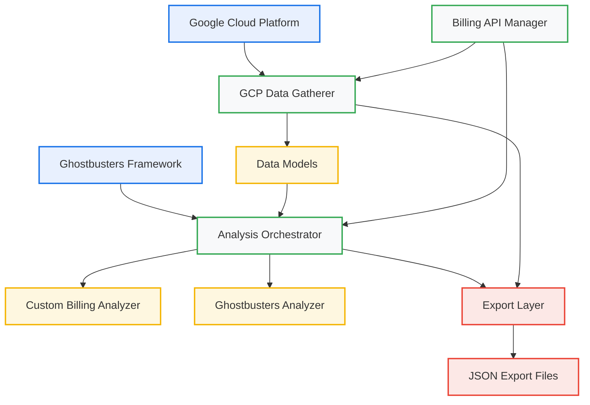
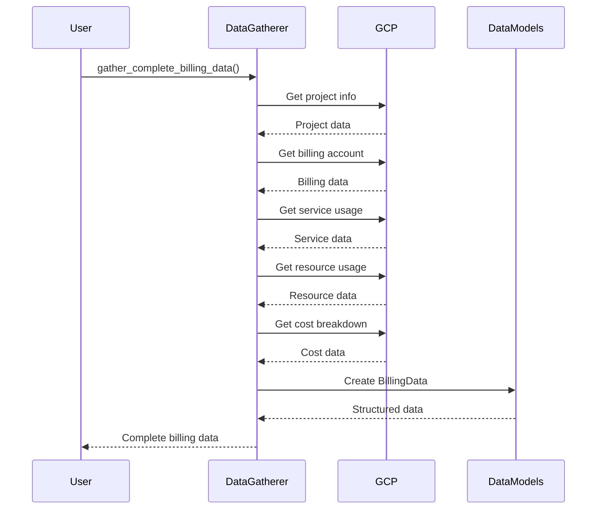
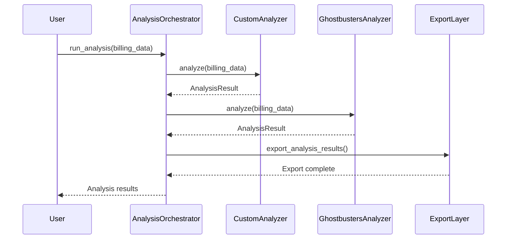
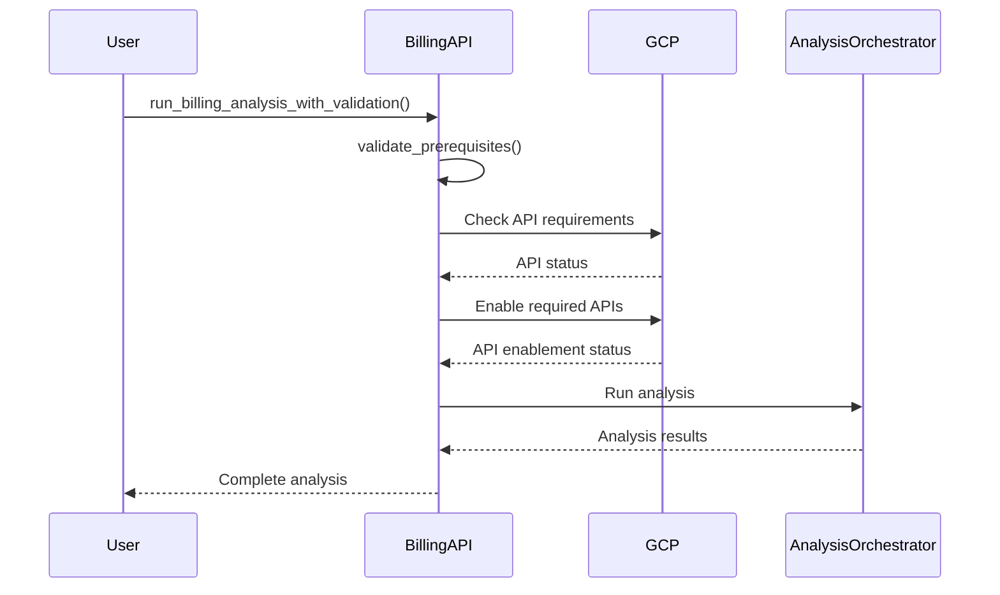

# GCP Data Collection & Analysis System Design

**Document:** GCP Data Collection & Analysis Design\
**Version:** 1.0\
**Date:** 2024-12-19\
**Status:** Implementation Ready

______________________________________________________________________

## 📋 **Executive Summary**

This document defines the architectural design for the GCP Data Collection & Analysis System, including component architecture, data flow, interfaces, and implementation patterns.

______________________________________________________________________

## 🏗️ **System Architecture**

### **High-Level Architecture**



### **Component Architecture**

#### **1. Data Collection Layer**

- **GCPDataGatherer**: Pure data gathering from GCP APIs
- **Data Models**: Structured data classes for all GCP data
- **API Integration**: GCP API client integration

#### **2. Analysis Layer**

- **AnalysisEngine**: Abstract base class for analysis engines
- **AnalysisOrchestrator**: Orchestrates multiple analysis engines
- **CustomBillingAnalyzer**: Custom billing analysis engine
- **GhostbustersAnalyzer**: Ghostbusters integration

#### **3. Billing Integration Layer**

- **BillingAnalyzerWithAPIManagement**: Enterprise-ready billing analysis
- **API Manager**: GCP API management and validation
- **Enterprise Workflow**: Enterprise workflow support

#### **4. Export Layer**

- **JSON Export**: Data and results export to JSON
- **Data Serialization**: Structured data serialization
- **File Management**: Output file management

______________________________________________________________________

## 🔧 **Component Design**

### **C1: GCP Data Gatherer**

#### **Purpose**

Pure data gathering layer that collects GCP project, billing, service, and resource data from GCP APIs.

#### **Responsibilities**

- Collect GCP project information
- Gather billing account data
- Monitor service usage
- Track resource usage
- Collect cost breakdown data
- Export collected data

#### **Interface**

```python
class GCPDataGatherer:
    def __init__(self, project_id: Optional[str] = None)
    def gather_project_info(self) -> GCPProjectInfo
    def gather_billing_account_info(self) -> Optional[BillingAccountInfo]
    def gather_service_usage(self) -> List[ServiceUsage]
    def gather_resource_usage(self) -> List[ResourceUsage]
    def gather_cost_breakdown(self) -> Dict[str, Any]
    def gather_complete_billing_data(self) -> BillingData
    def export_billing_data(self, billing_data: BillingData, output_path: str) -> None
```

#### **Implementation Pattern**

- **Pure Data Gathering**: No analysis logic, only data collection
- **Error Handling**: Graceful handling of API failures
- **Logging**: Comprehensive logging for debugging
- **Type Safety**: Strong typing with dataclasses

### **C2: Analysis Orchestrator**

#### **Purpose**

Orchestrates multiple analysis engines and aggregates their results.

#### **Responsibilities**

- Manage analysis engine lifecycle
- Run analysis with multiple engines
- Aggregate analysis results
- Handle engine failures
- Export analysis results

#### **Interface**

```python
class AnalysisOrchestrator:
    def __init__(self, project_path: str = ".")
    def run_analysis(self, billing_data: BillingData, engine_names: Optional[List[str]] = None) -> Dict[str, AnalysisResult]
    def get_available_engines(self) -> List[str]
    def export_analysis_results(self, results: Dict[str, AnalysisResult], output_path: str) -> None
```

#### **Implementation Pattern**

- **Plugin Architecture**: Support for multiple analysis engines
- **Error Isolation**: Engine failures don't affect other engines
- **Result Aggregation**: Combine results from multiple engines
- **Extensibility**: Easy addition of new analysis engines

### **C3: Custom Billing Analyzer**

#### **Purpose**

Custom analysis engine for billing data analysis and cost optimization.

#### **Responsibilities**

- Analyze service usage patterns
- Detect unused services and resources
- Calculate resource efficiency scores
- Identify cost optimization opportunities
- Generate cost anomaly alerts

#### **Interface**

```python
class CustomBillingAnalysisEngine(AnalysisEngine):
    def __init__(self)
    def analyze(self, billing_data: BillingData) -> BillingAnalysisResult
    def get_engine_name(self) -> str
```

#### **Implementation Pattern**

- **Rule-Based Analysis**: Configurable analysis rules
- **Cost Optimization**: Focus on cost reduction opportunities
- **Efficiency Metrics**: Resource utilization analysis
- **Anomaly Detection**: Unusual cost pattern detection

### **C4: Ghostbusters Analyzer**

#### **Purpose**

Integration with the Ghostbusters multi-agent analysis framework.

#### **Responsibilities**

- Integrate with Ghostbusters framework
- Convert Ghostbusters results to standard format
- Handle Ghostbusters unavailability
- Provide delusion detection capabilities

#### **Interface**

```python
class GhostbustersAnalysisEngine(AnalysisEngine):
    def __init__(self, project_path: str = ".")
    def analyze(self, billing_data: BillingData) -> AnalysisResult
    def get_engine_name(self) -> str
```

#### **Implementation Pattern**

- **Framework Integration**: Seamless Ghostbusters integration
- **Result Conversion**: Standardize Ghostbusters output
- **Graceful Degradation**: Handle framework unavailability
- **Multi-Agent Support**: Leverage Ghostbusters agents

### **C5: Billing API Manager**

#### **Purpose**

Enterprise-ready API management for GCP billing operations.

#### **Responsibilities**

- Validate API prerequisites
- Enable required APIs
- Handle enterprise workflows
- Manage API permissions
- Generate enterprise reports

#### **Interface**

```python
class BillingAnalyzerWithAPIManagement:
    def __init__(self, project_id: Optional[str] = None, enterprise_scenario: str = "admin_credentials")
    def validate_prerequisites(self) -> Dict[str, Any]
    def enable_required_apis(self, force: bool = False) -> Dict[str, Any]
    def run_billing_analysis_with_validation(self) -> Dict[str, Any]
    def generate_enterprise_workflow_report(self) -> Dict[str, Any]
```

#### **Implementation Pattern**

- **Enterprise Support**: Handle enterprise workflow requirements
- **API Management**: Comprehensive API lifecycle management
- **Validation**: Prerequisite validation and reporting
- **Workflow Support**: Enterprise workflow guidance

______________________________________________________________________

## 📊 **Data Flow Design**

### **Data Collection Flow**



### **Analysis Flow**



### **Billing Integration Flow**



______________________________________________________________________

## 🔌 **Interface Design**

### **I1: Data Collection Interface**

#### **GCPDataGatherer Interface**

```python
class GCPDataGatherer:
    """Pure data gathering layer for GCP billing and infrastructure data"""
    
    def __init__(self, project_id: Optional[str] = None):
        """Initialize the data gatherer"""
        pass
    
    def gather_project_info(self) -> GCPProjectInfo:
        """Gather comprehensive project information"""
        pass
    
    def gather_billing_account_info(self) -> Optional[BillingAccountInfo]:
        """Gather billing account information"""
        pass
    
    def gather_service_usage(self) -> List[ServiceUsage]:
        """Gather service usage information"""
        pass
    
    def gather_resource_usage(self) -> List[ResourceUsage]:
        """Gather resource usage information"""
        pass
    
    def gather_cost_breakdown(self) -> Dict[str, Any]:
        """Gather cost breakdown information"""
        pass
    
    def gather_complete_billing_data(self) -> BillingData:
        """Gather complete billing data from all sources"""
        pass
    
    def export_billing_data(self, billing_data: BillingData, output_path: str) -> None:
        """Export billing data to JSON file"""
        pass
```

### **I2: Analysis Interface**

#### **AnalysisEngine Interface**

```python
class AnalysisEngine(ABC):
    """Abstract base class for analysis engines"""
    
    @abstractmethod
    def analyze(self, billing_data: BillingData) -> AnalysisResult:
        """Analyze billing data and return results"""
        pass
    
    @abstractmethod
    def get_engine_name(self) -> str:
        """Get the name of this analysis engine"""
        pass
```

#### **AnalysisOrchestrator Interface**

```python
class AnalysisOrchestrator:
    """Orchestrator for running multiple analysis engines"""
    
    def __init__(self, project_path: str = "."):
        """Initialize the analysis orchestrator"""
        pass
    
    def run_analysis(self, billing_data: BillingData, engine_names: Optional[List[str]] = None) -> Dict[str, AnalysisResult]:
        """Run analysis using specified engines"""
        pass
    
    def get_available_engines(self) -> List[str]:
        """Get list of available analysis engines"""
        pass
    
    def export_analysis_results(self, results: Dict[str, AnalysisResult], output_path: str) -> None:
        """Export analysis results to JSON file"""
        pass
```

### **I3: Billing Integration Interface**

#### **BillingAnalyzerWithAPIManagement Interface**

```python
class BillingAnalyzerWithAPIManagement:
    """Enhanced billing analyzer with API management capabilities"""
    
    def __init__(self, project_id: Optional[str] = None, enterprise_scenario: str = "admin_credentials"):
        """Initialize the enhanced billing analyzer"""
        pass
    
    def validate_prerequisites(self) -> Dict[str, Any]:
        """Validate all prerequisites for billing analysis"""
        pass
    
    def enable_required_apis(self, force: bool = False) -> Dict[str, Any]:
        """Enable all required APIs for billing analysis"""
        pass
    
    def run_billing_analysis_with_validation(self) -> Dict[str, Any]:
        """Run billing analysis with full validation and API management"""
        pass
    
    def generate_enterprise_workflow_report(self) -> Dict[str, Any]:
        """Generate comprehensive enterprise workflow report"""
        pass
```

______________________________________________________________________

## 📋 **Data Model Design**

### **DM1: Core Data Models**

#### **GCPProjectInfo**

```python
@dataclass
class GCPProjectInfo:
    """GCP Project information"""
    project_id: str
    project_name: str
    project_number: str
    billing_account_id: Optional[str] = None
    billing_enabled: bool = False
    labels: Dict[str, str] = field(default_factory=dict)
```

#### **BillingAccountInfo**

```python
@dataclass
class BillingAccountInfo:
    """Billing account information"""
    account_id: str
    display_name: str
    open: bool
    currency_code: str
    master_billing_account: Optional[str] = None
```

#### **ServiceUsage**

```python
@dataclass
class ServiceUsage:
    """Service usage information"""
    service_name: str
    enabled: bool
    quota_metrics: List[Dict[str, Any]] = field(default_factory=list)
    usage_metrics: List[Dict[str, Any]] = field(default_factory=list)
```

#### **ResourceUsage**

```python
@dataclass
class ResourceUsage:
    """Resource usage information"""
    resource_type: str
    resource_name: str
    location: str
    usage_amount: float
    usage_unit: str
    timestamp: datetime
    cost_estimate: Optional[float] = None
```

#### **BillingData**

```python
@dataclass
class BillingData:
    """Complete billing data structure"""
    project_info: GCPProjectInfo
    billing_account: Optional[BillingAccountInfo]
    service_usage: List[ServiceUsage]
    resource_usage: List[ResourceUsage]
    cost_breakdown: Dict[str, Any]
    timestamp: datetime
    data_source: str = "gcp_apis"
```

### **DM2: Analysis Data Models**

#### **AnalysisResult**

```python
@dataclass
class AnalysisResult:
    """Result of an analysis operation"""
    analysis_id: str
    analysis_type: str
    analyzer_name: str
    confidence_score: float
    findings: List[Dict[str, Any]]
    recommendations: List[Dict[str, Any]]
    metadata: Dict[str, Any] = field(default_factory=dict)
    timestamp: datetime = field(default_factory=datetime.now)
```

#### **BillingAnalysisResult**

```python
@dataclass
class BillingAnalysisResult(AnalysisResult):
    """Specialized result for billing analysis"""
    cost_optimization_score: float
    cost_anomalies: List[Dict[str, Any]]
    budget_alerts: List[Dict[str, Any]]
    resource_efficiency: Dict[str, Any]
```

______________________________________________________________________

## 🔧 **Implementation Patterns**

### **P1: Data Collection Pattern**

#### **Pure Data Gathering**

- No analysis logic in data collection layer
- Focus on data accuracy and completeness
- Graceful error handling for API failures
- Comprehensive logging for debugging

#### **Structured Data Models**

- Use dataclasses for type safety
- Include metadata and timestamps
- Support optional fields for missing data
- Provide default values for consistency

### **P2: Analysis Pattern**

#### **Plugin Architecture**

- Abstract base class for analysis engines
- Easy addition of new analysis engines
- Standardized result format
- Error isolation between engines

#### **Orchestration Pattern**

- Central orchestrator for multiple engines
- Result aggregation and combination
- Failure handling and recovery
- Extensible engine management

### **P3: Billing Integration Pattern**

#### **Enterprise Support**

- Handle enterprise workflow requirements
- API prerequisite validation
- Permission and access management
- Comprehensive reporting

#### **API Management**

- Centralized API lifecycle management
- Prerequisite validation and reporting
- Enterprise workflow guidance
- Error handling and recovery

### **P4: Export Pattern**

#### **JSON Export**

- Structured data serialization
- Metadata preservation
- Timestamp and source tracking
- File management and organization

#### **Data Serialization**

- Convert dataclasses to dictionaries
- Handle datetime serialization
- Preserve data structure
- Error handling for serialization

______________________________________________________________________

## 🧪 **Testing Design**

### **T1: Unit Testing**

#### **Data Collection Testing**

- Test all data gathering methods
- Mock GCP API responses
- Test error handling scenarios
- Validate data model creation

#### **Analysis Testing**

- Test analysis engine interfaces
- Mock billing data for testing
- Test result aggregation
- Validate error handling

### **T2: Integration Testing**

#### **GCP API Integration**

- Test with real GCP APIs
- Validate authentication
- Test API error handling
- Verify data accuracy

#### **Analysis Engine Integration**

- Test multiple analysis engines
- Validate result aggregation
- Test orchestration logic
- Verify export functionality

### **T3: Performance Testing**

#### **Response Time Testing**

- Measure data collection time
- Test analysis performance
- Validate export speed
- Monitor memory usage

#### **Throughput Testing**

- Test with large datasets
- Validate concurrent operations
- Monitor resource usage
- Test scalability limits

______________________________________________________________________

## 📋 **Deployment Design**

### **D1: Local Development**

#### **Prerequisites**

- Python 3.8+
- GCP CLI installed and configured
- Service account with appropriate permissions
- Required Python packages

#### **Configuration**

- Environment variables for GCP credentials
- Project ID configuration
- Output directory setup
- Logging configuration

### **D2: Production Deployment**

#### **Container Deployment**

- Docker containerization
- Kubernetes deployment
- Resource limits and requests
- Health checks and monitoring

#### **Cloud Deployment**

- GCP Cloud Run deployment
- Auto-scaling configuration
- Monitoring and logging
- Security and access control

______________________________________________________________________

## 🚀 **Implementation Guide**

### **Phase 1: Core Data Collection**

1. Implement GCPDataGatherer class
1. Create data model classes
1. Implement GCP API integration
1. Add error handling and logging
1. Create unit tests

### **Phase 2: Analysis Layer**

1. Implement AnalysisEngine interface
1. Create CustomBillingAnalysisEngine
1. Implement AnalysisOrchestrator
1. Add Ghostbusters integration
1. Create integration tests

### **Phase 3: Billing Integration**

1. Implement BillingAnalyzerWithAPIManagement
1. Add API management functionality
1. Implement enterprise workflow support
1. Add comprehensive validation
1. Create performance tests

### **Phase 4: Export and Testing**

1. Implement export functionality
1. Add comprehensive testing
1. Performance optimization
1. Documentation completion
1. Production deployment

______________________________________________________________________

**This design document provides the complete architectural specification for implementing the GCP Data Collection & Analysis System with Beast Mode principles!** 🚀
