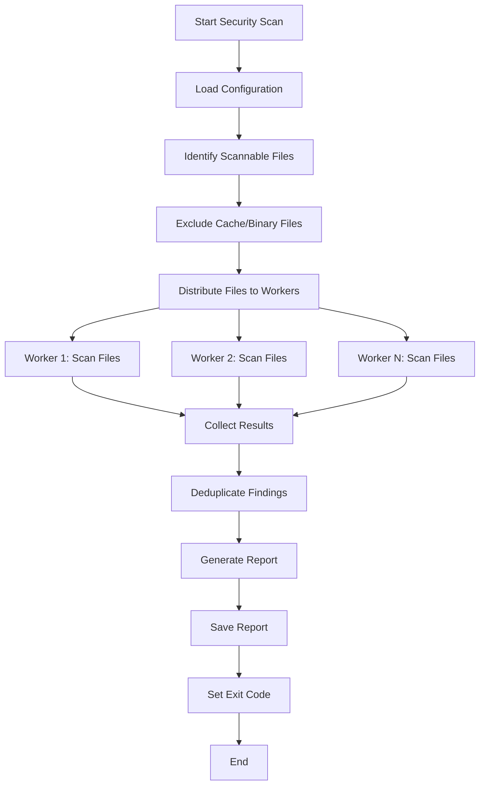
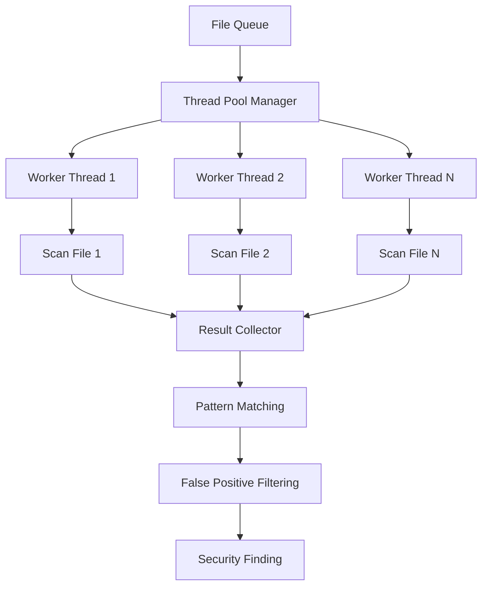

# Security Scanning Domain Model

## 🎯 Domain Overview

The Security Scanning domain is responsible for detecting security vulnerabilities, credential exposure, and compliance violations across all file types in the project. This domain operates independently with its own package structure and isolation boundaries.

## 🏗️ Architecture Principles

### 1. **Domain Isolation**
- **Independent Package**: `src/security_scanning/` - No cross-domain dependencies
- **Own Configuration**: Domain-specific configuration and rules
- **Isolated Testing**: Self-contained test suite
- **Clear Boundaries**: Well-defined interfaces with other domains

### 2. **Multi-Threaded Design**
- **Parallel Processing**: Scan multiple files simultaneously
- **CPU Optimization**: Distribute work across available cores
- **Async Operations**: Non-blocking I/O for file operations
- **Resource Management**: Controlled concurrency to prevent system overload

### 3. **Extensible Pattern System**
- **Plugin Architecture**: Easy to add new security patterns
- **Rule Engine**: Configurable detection rules
- **False Positive Management**: Intelligent filtering and learning
- **Custom Patterns**: Domain-specific security requirements

## 📋 Use Cases

### **UC-001: Comprehensive Project Security Scan**
**Actor**: Developer, CI/CD System, Security Team  
**Precondition**: Project files accessible, security scanner configured  
**Main Flow**:
1. System initiates security scan
2. Scanner loads security patterns and rules
3. Scanner identifies scannable files (excludes caches, binaries, etc.)
4. Scanner distributes files across worker threads
5. Each worker scans assigned files for security patterns
6. Results are aggregated and deduplicated
7. System generates comprehensive security report
8. System saves report and exits with appropriate status code

**Postcondition**: Security report generated, vulnerabilities documented, exit code set

### **UC-002: Real-Time Security Monitoring**
**Actor**: Development Environment, IDE Integration  
**Precondition**: File watcher active, security patterns loaded  
**Main Flow**:
1. File system change detected
2. Changed file queued for security scan
3. Scanner processes file in background
4. Immediate notification if critical issues found
5. Results cached for performance
6. Developer notified of security issues

**Postcondition**: Security issues immediately identified, developer notified

### **UC-003: Pre-commit Security Validation**
**Actor**: Git Pre-commit Hook, Developer  
**Precondition**: Pre-commit hooks configured, staged files identified  
**Main Flow**:
1. Pre-commit hook triggers security scan
2. Scanner analyzes only staged files
3. Quick scan with focused patterns
4. Block commit if critical issues found
5. Provide actionable feedback to developer
6. Allow commit if no critical issues

**Postcondition**: Commit blocked or allowed based on security scan results

### **UC-004: Security Pattern Management**
**Actor**: Security Team, DevOps Engineer  
**Precondition**: Access to security configuration  
**Main Flow**:
1. Security team reviews current patterns
2. New security threats identified
3. New patterns added to configuration
4. Existing patterns updated or deprecated
5. False positive patterns refined
6. Configuration validated and deployed

**Postcondition**: Security patterns updated, scanner enhanced

### **UC-005: Security Report Generation**
**Actor**: Security Team, Management, CI/CD System  
**Precondition**: Security scan completed  
**Main Flow**:
1. Raw scan results collected
2. Results categorized by severity and type
3. False positives filtered out
4. Report formatted for different audiences
5. Report exported in multiple formats (JSON, HTML, Markdown)
6. Report distributed to stakeholders

**Postcondition**: Comprehensive security report available in multiple formats

## 🔄 Activity Diagrams

### **Security Scan Workflow**


### **Multi-Threaded File Processing**


## 📊 Requirements

### **Functional Requirements**

#### **FR-001: Multi-Threaded Processing**
- **Requirement**: Scanner must process multiple files simultaneously
- **Acceptance Criteria**: 
  - Utilizes all available CPU cores efficiently
  - CPU usage distributed across cores, not single-threaded
  - Configurable thread pool size
  - Graceful degradation under resource constraints

#### **FR-002: Comprehensive File Coverage**
- **Requirement**: Scanner must detect security issues in all text file types
- **Acceptance Criteria**:
  - Scans Python, JavaScript, YAML, JSON, Markdown, Shell scripts
  - Excludes binary files, cache files, lock files
  - Configurable file inclusion/exclusion patterns
  - Handles large files efficiently

#### **FR-003: Pattern-Based Detection**
- **Requirement**: Scanner must detect security patterns with configurable rules
- **Acceptance Criteria**:
  - Detects API keys, credentials, secrets, tokens
  - Configurable pattern definitions
  - False positive filtering
  - Pattern severity classification

#### **FR-004: Real-Time Reporting**
- **Requirement**: Scanner must provide immediate feedback on security issues
- **Acceptance Criteria**:
  - Real-time progress updates
  - Immediate critical issue notification
  - Configurable output formats
  - Exit codes for CI/CD integration

### **Non-Functional Requirements**

#### **NFR-001: Performance**
- **Requirement**: Scanner must complete full project scan in under 30 seconds
- **Acceptance Criteria**:
  - Multi-threaded processing
  - Efficient file I/O operations
  - Optimized pattern matching
  - Configurable performance tuning

#### **NFR-002: Scalability**
- **Requirement**: Scanner must handle projects with 10,000+ files
- **Acceptance Criteria**:
  - Linear scaling with file count
  - Memory usage optimization
  - Configurable resource limits
  - Graceful handling of large files

#### **NFR-003: Reliability**
- **Requirement**: Scanner must be 99.9% reliable
- **Acceptance Criteria**:
  - Error handling for corrupted files
  - Graceful degradation on system issues
  - Comprehensive logging
  - Recovery mechanisms

#### **NFR-004: Maintainability**
- **Requirement**: Scanner must be easy to maintain and extend
- **Acceptance Criteria**:
  - Clear separation of concerns
  - Plugin architecture for patterns
  - Comprehensive documentation
  - Unit test coverage >90%

## 🗣️ Communication Elements

### **Interfaces with Other Domains**

#### **1. Multi-Agent Testing Domain**
- **Purpose**: Security validation in multi-agent scenarios
- **Interface**: Security scan results as agent input
- **Data Flow**: Security findings → Agent decision making
- **Integration**: REST API for real-time security status

#### **2. CI/CD Pipeline Domain**
- **Purpose**: Automated security validation in deployment
- **Interface**: Exit codes and report files
- **Data Flow**: Scan results → Pipeline gates
- **Integration**: Pre-commit hooks, GitHub Actions

#### **3. Project Model Domain**
- **Purpose**: Security configuration and rule management
- **Interface**: Security domain configuration
- **Data Flow**: Model updates → Security rule updates
- **Integration**: Configuration synchronization

### **External System Integration**

#### **1. Git Hooks**
- **Purpose**: Pre-commit security validation
- **Interface**: Command-line interface with exit codes
- **Data Flow**: Staged files → Security scan → Commit decision
- **Integration**: Git pre-commit hook configuration

#### **2. IDE Integration**
- **Purpose**: Real-time security feedback during development
- **Interface**: File change notifications
- **Data Flow**: File changes → Security scan → IDE notifications
- **Integration**: VS Code, Cursor, PyCharm extensions

#### **3. CI/CD Systems**
- **Purpose**: Automated security scanning in pipelines
- **Interface**: Report files and exit codes
- **Data Flow**: Code changes → Security scan → Pipeline gates
- **Integration**: GitHub Actions, GitLab CI, Jenkins

## 🏛️ Package Structure

```
src/security_scanning/
├── __init__.py
├── core/
│   ├── __init__.py
│   ├── scanner.py              # Main scanner orchestrator
│   ├── worker_pool.py          # Multi-threaded worker management
│   ├── file_processor.py       # File processing logic
│   └── result_aggregator.py    # Result collection and deduplication
├── patterns/
│   ├── __init__.py
│   ├── pattern_manager.py      # Pattern loading and management
│   ├── credential_patterns.py  # Credential detection patterns
│   ├── vulnerability_patterns.py # Vulnerability detection patterns
│   └── compliance_patterns.py  # Compliance checking patterns
├── reporting/
│   ├── __init__.py
│   ├── report_generator.py     # Report generation
│   ├── formatters/
│   │   ├── __init__.py
│   │   ├── json_formatter.py   # JSON report format
│   │   ├── html_formatter.py   # HTML report format
│   │   └── markdown_formatter.py # Markdown report format
│   └── notifiers/
│       ├── __init__.py
│       ├── console_notifier.py # Console output
│       └── file_notifier.py    # File-based notifications
├── configuration/
│   ├── __init__.py
│   ├── config_manager.py       # Configuration management
│   ├── rule_engine.py          # Rule processing engine
│   └── settings.py             # Default settings
├── utils/
│   ├── __init__.py
│   ├── file_utils.py           # File handling utilities
│   ├── crypto_utils.py         # Cryptographic utilities
│   └── performance_utils.py    # Performance monitoring
└── cli/
    ├── __init__.py
    └── main.py                 # Command-line interface
```

## 🧪 Testing Strategy

### **Unit Tests**
- **Pattern Matching**: Test individual security patterns
- **File Processing**: Test file handling and filtering
- **Worker Pool**: Test multi-threading functionality
- **Result Aggregation**: Test result processing and deduplication

### **Integration Tests**
- **End-to-End Scanning**: Test complete scanning workflow
- **Multi-Threading**: Test concurrent file processing
- **Performance**: Test scanning performance and scaling
- **Error Handling**: Test system behavior under failure conditions

### **Performance Tests**
- **Scalability**: Test with varying file counts
- **Resource Usage**: Test CPU and memory utilization
- **Throughput**: Test files processed per second
- **Concurrency**: Test optimal thread pool sizing

## 🚀 Implementation Phases

### **Phase 1: Core Architecture**
- Basic scanner structure
- Multi-threaded worker pool
- File processing pipeline
- Basic pattern matching

### **Phase 2: Pattern System**
- Extensible pattern framework
- Credential detection patterns
- False positive filtering
- Pattern configuration management

### **Phase 3: Reporting & Integration**
- Multiple report formats
- CI/CD integration
- Pre-commit hooks
- Performance optimization

### **Phase 4: Advanced Features**
- Real-time monitoring
- IDE integration
- Machine learning for false positive reduction
- Compliance reporting

## 📈 Success Metrics

### **Performance Metrics**
- **Scan Time**: <30 seconds for 10,000 files
- **CPU Utilization**: Distributed across all cores
- **Memory Usage**: <500MB for large projects
- **Throughput**: >1000 files/second

### **Quality Metrics**
- **Detection Rate**: >95% for known security patterns
- **False Positive Rate**: <5%
- **Coverage**: 100% of scannable text files
- **Reliability**: 99.9% successful scans

### **Usability Metrics**
- **Ease of Use**: Simple command-line interface
- **Configuration**: <5 minutes to set up
- **Integration**: Seamless CI/CD integration
- **Documentation**: Comprehensive and clear

This domain model provides the foundation for a robust, scalable, and maintainable security scanning system that addresses the current single-threaded limitations and provides comprehensive security coverage across the entire project.
