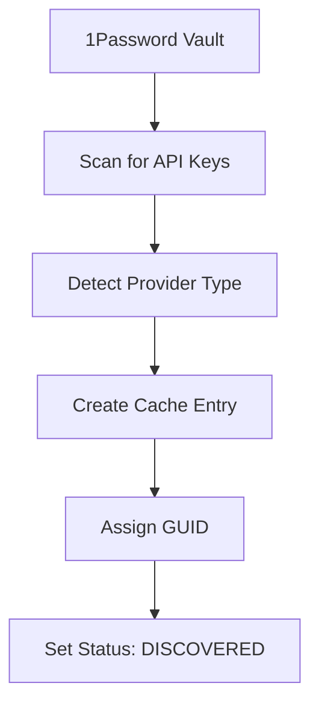
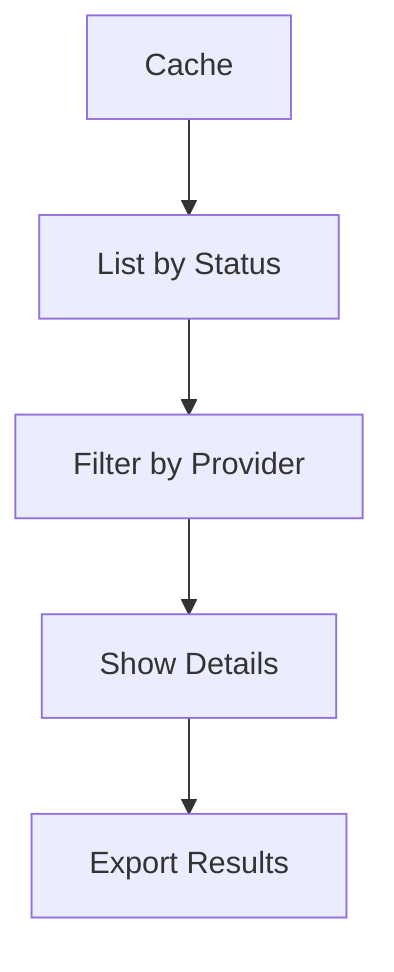
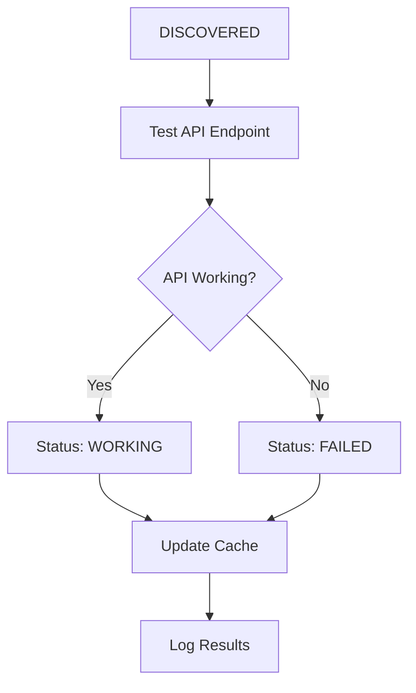
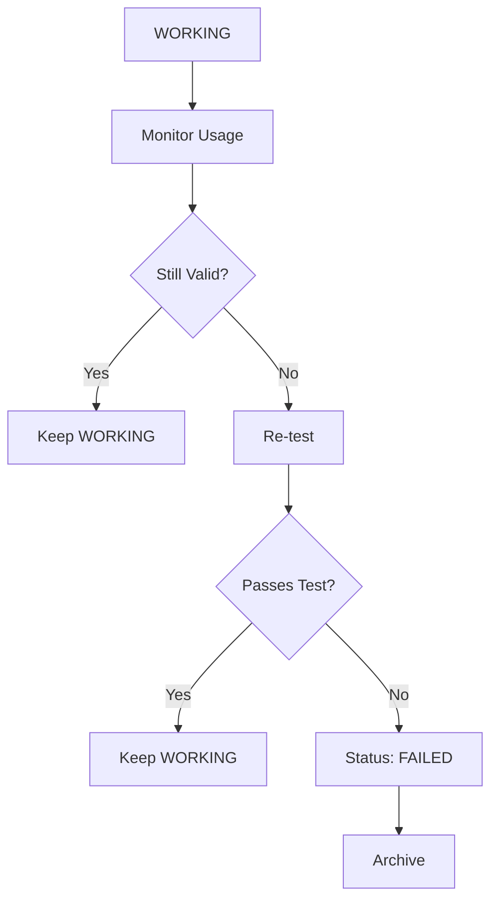
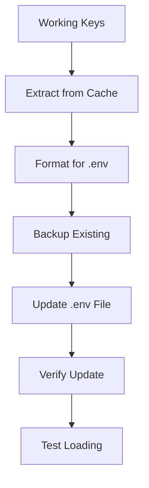

# OP API Manager Domain Model

## 🎯 **Domain Purpose**

**Intelligent API key discovery and management for 1Password, completely separate from multi-agent systems.**

The op-api-manager serves as a **convenience function** for:

1. **Retrieving** API keys from 1Password
1. **Testing** API endpoints for functionality
1. **Persisting** working keys to environment files
1. **Managing** API key lifecycle (discovery → testing → working → archived)

## 🏗️ **Architecture Principles**

### **Separation of Concerns**

- **op-api-manager**: Standalone tool for API key management
- **Multi-agent systems**: Use environment variables, never call 1Password directly
- **No tight coupling**: op-api-manager is a utility, not a dependency

### **CRUD Operations Coverage**

Every API key goes through a complete lifecycle with full CRUD coverage:

- **Create**: Discovery and initial creation in cache
- **Read**: Retrieval, listing, and status checking
- **Update**: Status changes, testing results, metadata updates
- **Delete**: Archiving and removal from active use

## 📋 **Core Use Cases**

### **1. Discovery & Creation (CREATE)**



**Commands:**

- `discover` - Initial discovery and creation
- `refresh` - Force re-discovery

**Use Cases:**

- Initial setup and onboarding
- Adding new API keys to 1Password
- Periodic refresh of available keys

### **2. Retrieval & Reading (READ)**



**Commands:**

- `summary` - Overview of all keys
- `working` - Show working keys only
- `providers` - Breakdown by provider
- `ids` - Show full identifiers
- `cache` - Cache status and information

**Use Cases:**

- Inventory management
- Status reporting
- Provider analysis
- Debugging and troubleshooting

### **3. Testing & Validation (UPDATE)**



**Commands:**

- `test` - Test all discovered APIs
- `working --force-test` - Re-test all APIs

**Use Cases:**

- Validation of API functionality
- Quality assurance
- Troubleshooting failed APIs
- Performance monitoring

### **4. Lifecycle Management (UPDATE)**



**Commands:**

- `archive` - Archive failed/unused keys
- Status transitions in cache

**Use Cases:**

- Key rotation and expiration
- Cleanup of unused keys
- Compliance and security

### **5. Environment Integration (CREATE/UPDATE)**



**Commands:**

- `env-update` - Update .env file with working keys
- `env-verify` - Verify .env file integrity

**Use Cases:**

- Multi-agent system setup
- Development environment configuration
- CI/CD environment setup
- Breaking free from 1Password dependency

## 🔧 **Command Structure & Organization**

### **Discovery & Creation Commands**

```bash
# Core discovery
op-api-manager discover          # Initial discovery
op-api-manager refresh           # Force refresh
op-api-manager cache             # Cache status
```

### **Read & Report Commands**

```bash
# Information display
op-api-manager summary           # Overview
op-api-manager working           # Working keys only
op-api-manager providers         # Provider breakdown
op-api-manager ids               # Full identifiers
```

### **Testing & Validation Commands**

```bash
# API testing
op-api-manager test              # Test all APIs
op-api-manager working --force-test  # Re-test all
```

### **Lifecycle Management Commands**

```bash
# Status management
op-api-manager archive           # Archive keys
op-api-manager status            # Status transitions
```

### **Environment Integration Commands**

```bash
# Environment management
op-api-manager env-update        # Update .env file
op-api-manager env-verify        # Verify .env file
op-api-manager env-backup        # Backup .env file
```

## 🎯 **Use Case Scenarios**

### **Scenario 1: Initial Setup**

```bash
# 1. Discover all available API keys
op-api-manager discover --verbose

# 2. Test all discovered APIs
op-api-manager test --verbose

# 3. Show working keys
op-api-manager working

# 4. Update environment file
op-api-manager env-update --backup --verify
```

### **Scenario 2: Regular Maintenance**

```bash
# 1. Check cache status
op-api-manager cache

# 2. Re-test working keys
op-api-manager working --force-test

# 3. Archive failed keys
op-api-manager archive <item_id> --reason "API no longer working"

# 4. Update environment if needed
op-api-manager env-update
```

### **Scenario 3: Troubleshooting**

```bash
# 1. Check what's available
op-api-manager summary --provider aws

# 2. Test specific provider
op-api-manager test --provider aws

# 3. Show detailed IDs
op-api-manager ids --provider aws

# 4. Archive problematic keys
op-api-manager archive <item_id> --reason "Consistent failures"
```

### **Scenario 4: Multi-Agent System Setup**

```bash
# 1. Ensure working keys are cached
op-api-manager working

# 2. Update environment file
op-api-manager env-update --backup --verify

# 3. Verify environment loading
op-api-manager env-verify

# 4. Multi-agent systems now work without 1Password calls
```

## 🔒 **Security & Privacy**

### **Credential Handling**

- **Never store actual credentials** in cache files
- **Cache only metadata** (ID, title, status, provider)
- **Retrieve credentials on-demand** from 1Password
- **Immediate cleanup** after use

### **Access Control**

- **1Password authentication required** for all operations
- **Session management** with automatic timeout
- **Audit logging** of all operations
- **No credential persistence** in plain text

### **Environment File Security**

- **Backup existing files** before modification
- **Verify file integrity** after updates
- **Secure file permissions** on .env files
- **No credential logging** in command output

## 📊 **Data Flow & State Management**

### **Cache Structure**

```json
{
  "api_keys": [
    {
      "id": "1password_item_id",
      "title": "Human readable title",
      "provider": "aws|azure|openai|anthropic|google|unknown",
      "status": "discovered|tested|working|failed|archived",
      "guid": "unique_identifier",
      "metadata": {},
      "created_at": "timestamp",
      "updated_at": "timestamp"
    }
  ],
  "discovery_timestamp": "timestamp",
  "cache_version": "1.0"
}
```

### **Status Transitions**

```
DISCOVERED → TESTED → WORKING → ARCHIVED
     ↓           ↓        ↓
   FAILED ←─── FAILED ←── FAILED
```

### **Provider Detection**

- **AWS**: Access key + Secret key pairs
- **Azure**: API keys, connection strings
- **OpenAI**: API keys
- **Anthropic**: API keys
- **Google**: API keys, service accounts
- **Unknown**: Generic API keys, tokens

## 🧪 **Testing Strategy**

### **Unit Tests**

- **Command parsing** and validation
- **Cache operations** and persistence
- **Provider detection** logic
- **Status management** and transitions

### **Integration Tests**

- **1Password CLI integration**
- **API endpoint testing**
- **Environment file operations**
- **Cache consistency**

### **End-to-End Tests**

- **Complete workflow testing**
- **Error handling** and recovery
- **Performance testing** with large vaults
- **Security testing** and validation

## 🚀 **Future Enhancements**

### **Planned Features**

- **Batch operations** for multiple keys
- **Scheduled testing** and monitoring
- **Webhook integration** for status changes
- **Advanced filtering** and search
- **Export formats** (JSON, CSV, YAML)

### **Integration Opportunities**

- **CI/CD pipelines** for automated testing
- **Monitoring systems** for API health
- **Security tools** for credential scanning
- **Compliance tools** for audit trails

## 📝 **Implementation Notes**

### **Dependencies**

- **1Password CLI** (`op`) for vault access
- **Click** for CLI framework
- **Rich** for terminal output
- **Pydantic** for data validation
- **Python-dotenv** for environment file handling

### **Error Handling**

- **Graceful degradation** when 1Password unavailable
- **Comprehensive logging** for debugging
- **User-friendly error messages**
- **Recovery mechanisms** for common failures

### **Performance Considerations**

- **Efficient caching** to minimize 1Password calls
- **Batch operations** where possible
- **Async operations** for API testing
- **Progress indicators** for long-running operations

## 🎯 **Success Metrics**

### **Functional Metrics**

- **Discovery accuracy**: % of actual API keys found
- **Testing reliability**: % of tests that complete successfully
- **Cache consistency**: % of cache operations that succeed
- **Environment integration**: % of successful .env updates

### **User Experience Metrics**

- **Command completion time**: Average time per operation
- **Error rate**: % of commands that fail
- **User satisfaction**: Ease of use and reliability
- **Adoption rate**: Usage across development teams

### **Security Metrics**

- **Credential exposure**: Zero instances of credential logging
- **Access control**: Proper authentication enforcement
- **Audit coverage**: Complete operation logging
- **Compliance**: Meeting security requirements

______________________________________________________________________

**This domain model ensures comprehensive CRUD coverage while maintaining clear separation of concerns and security best practices.**
